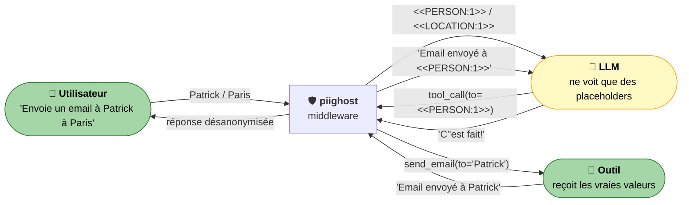
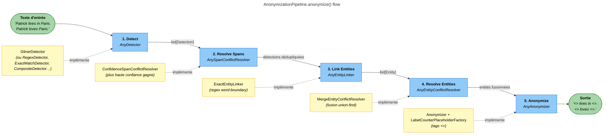
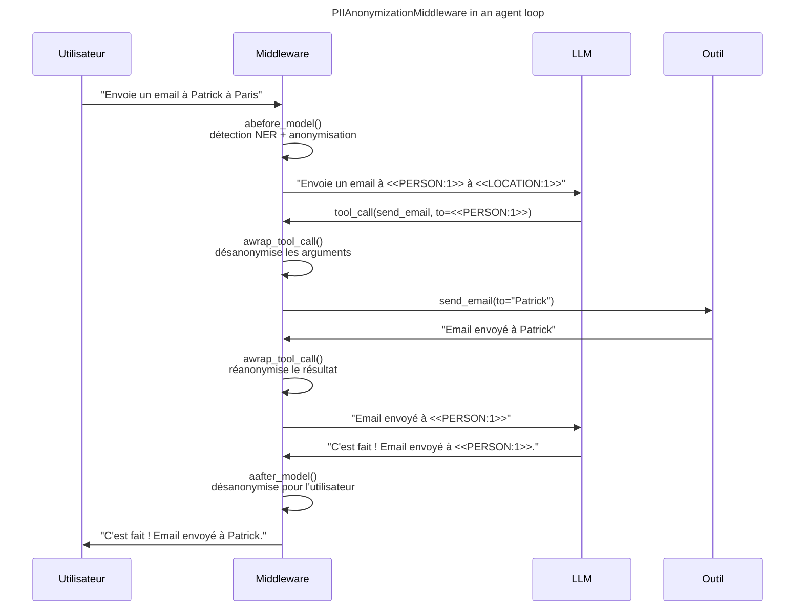

# PIIGhost

[](https://github.com/Athroniaeth/piighost/actions/workflows/ci.yml)
[](https://pypi.org/project/piighost/)
[](https://pypi.org/project/piighost/)
[](https://pypi.org/project/piighost/)
[](LICENSE)
[](https://athroniaeth.github.io/piighost/)
[](https://pytest.org/)
[](https://docs.astral.sh/ruff/)
[](https://github.com/PyCQA/bandit)

[README EN](README.md) - [README FR](README.fr.md)

`piighost` est un **pipeline d'anonymisation de PII composable** pour les agents LLM. Chaque étape (détection, liaison, résolution, anonymisation) est un `Protocol` Python que vous pouvez remplacer, vous gardez la main sur vos détecteurs (NER, regex, LLM, votre propre API) pendant que `piighost` s'occupe du reste : liaison d'entités inter-messages, cohérence des placeholders, et un middleware LangChain qui anonymise avant le LLM et désanonymise pour les outils et l'utilisateur final.



> Le LLM ne voit jamais `Patrick` ni `Paris`, mais votre outil `send_email` reçoit bien les vraies valeurs. L'utilisateur reçoit une réponse entièrement désanonymisée. Aucune modification de votre code agent.

## Table des matières

- [Pourquoi piighost ?](#pourquoi-piighost-)
- [Démarrage rapide](#démarrage-rapide)
- [Apportez votre propre détecteur](#apportez-votre-propre-détecteur)
- [Cas d'usage](#cas-dusage)
- [Fonctionnement](#fonctionnement)
  - [Pipeline](#pipeline)
  - [Glossaire : detection, span, entity](#glossaire--detection-span-entity)
  - [Middleware](#intégration-du-middleware)
- [Installation](#installation)
- [Composants du pipeline](#composants-du-pipeline)
- [FAQ](#faq)
- [Limites](#limites)
- [Développement et contribution](#développement)
- [Écosystème](#écosystème)
- [Soutenez-nous](#soutenez-nous)

## Pourquoi piighost ?

|                                                  | **piighost**                                | Microsoft Presidio | Regex maison        |
|--------------------------------------------------|---------------------------------------------|--------------------|---------------------|
| Détecteurs interchangeables (NER, regex, LLM…)   | ✅ via le protocole `AnyDetector`           | ⚠️ lié à spaCy / recognizers | ❌                  |
| Composer plusieurs détecteurs                    | ✅ `CompositeDetector` + résolveur de spans | ⚠️ partiel         | ❌                  |
| Liaison d'entités inter-messages                 | ✅ `ThreadAnonymizationPipeline` + mémoire  | ❌                 | ❌                  |
| Tolérance casse / fautes de frappe               | ✅ `ExactEntityLinker` + `FuzzyEntityResolver` | ❌              | ❌                  |
| Anonymisation réversible (deanonymize)           | ✅ avec cache                               | ⚠️ API séparée     | ❌                  |
| Middleware LangChain / LangGraph natif           | ✅ `PIIAnonymizationMiddleware`             | ❌                 | ❌                  |
| Désanonymise / réanonymise à l'appel d'outil     | ✅ `awrap_tool_call`                        | ❌                 | ❌                  |
| API async-first                                  | ✅                                          | ⚠️                 | ❌                  |
| Format de placeholder personnalisable            | ✅ `AnyPlaceholderFactory`                  | ⚠️ template seulement | dépend           |

Le vrai différenciateur n'est **pas le NER sous-jacent** : c'est le pipeline modulaire et le middleware natif LangGraph qui transforment n'importe quel détecteur en couche d'anonymisation prête pour la production.

## Démarrage rapide

Installez l'extra `cache` (utilisé par le pipeline) :

```bash
uv add 'piighost[cache]'
```

Anonymisez et désanonymisez sans télécharger de modèle. `ExactMatchDetector` matche un dictionnaire fixe via une regex aux frontières de mots, idéal pour essayer `piighost` en moins d'une minute.

```python
import asyncio

from piighost import Anonymizer, ExactMatchDetector
from piighost.pipeline import AnonymizationPipeline

detector = ExactMatchDetector([("Patrick", "PERSON"), ("Paris", "LOCATION")])
pipeline = AnonymizationPipeline(detector=detector, anonymizer=Anonymizer())


async def main() -> None:
    text, entities = await pipeline.anonymize("Patrick lives in Paris.")
    print(text)
    # <<PERSON:1>> lives in <<LOCATION:1>>.

    for entity in entities:
        print(f"  {entity.label}: {entity.detections[0].text}")
    # PERSON: Patrick
    # LOCATION: Paris


asyncio.run(main())
```

Pour la production, branchez un modèle NER ou votre propre détecteur ci-dessous.

<details>
<summary><strong>Configuration avancée</strong> (vrai NER, résolveurs personnalisés, pipeline complet)</summary>

```python
import asyncio
from gliner2 import GLiNER2

from piighost.anonymizer import Anonymizer
from piighost.detector.gliner2 import Gliner2Detector
from piighost.pipeline import AnonymizationPipeline

model = GLiNER2.from_pretrained("fastino/gliner2-multi-v1")
detector = Gliner2Detector(model=model, labels=["PERSON", "LOCATION"])
pipeline = AnonymizationPipeline(detector=detector, anonymizer=Anonymizer())


async def main() -> None:
    text = "Patrick lives in Paris. Patrick loves Paris."
    anonymized, entities = await pipeline.anonymize(text)
    print(anonymized)
    # <<PERSON:1>> lives in <<LOCATION:1>>. <<PERSON:1>> loves <<LOCATION:1>>.

    for entity in entities:
        print(f"  {entity.label}: {entity.detections[0].text}")
    # PERSON: Patrick
    # LOCATION: Paris

    original, _ = await pipeline.deanonymize(anonymized)
    print(original)
    # Patrick lives in Paris. Patrick loves Paris.


asyncio.run(main())
```

Remplacez `Gliner2Detector` par n'importe quelle implémentation de `AnyDetector` (spaCy, regex, API distante, votre propre détecteur, voir [Apportez votre propre détecteur](#apportez-votre-propre-détecteur)). Idem pour chaque autre étape du pipeline.

</details>

### Avec un middleware d'agent LangChain

Un middleware LangChain est un point d'extension qui s'exécute avant et après chaque appel au LLM et chaque appel d'outil. `piighost` s'y branche pour intercepter et transformer les messages, ce qui applique l'anonymisation des PII sans modifier le code de votre agent.

```python
from langchain.agents import create_agent
from langchain_core.tools import tool

from piighost.anonymizer import Anonymizer
from piighost.detector.gliner2 import Gliner2Detector
from piighost.pipeline import ThreadAnonymizationPipeline
from piighost.middleware import PIIAnonymizationMiddleware

from gliner2 import GLiNER2


@tool
def send_email(to: str, subject: str, body: str) -> str:
    """Send an email to a given address."""
    return f"Email successfully sent to {to}."


model = GLiNER2.from_pretrained("fastino/gliner2-multi-v1")
detector = Gliner2Detector(model=model, labels=["PERSON", "LOCATION"])
pipeline = ThreadAnonymizationPipeline(detector=detector, anonymizer=Anonymizer())
middleware = PIIAnonymizationMiddleware(pipeline=pipeline)

graph = create_agent(
    model="openai:gpt-5.4",
    system_prompt="You are a helpful assistant.",
    tools=[send_email],
    middleware=[middleware],
)
```

Le middleware intercepte chaque tour de l'agent. Le LLM ne voit que le texte anonymisé, les outils reçoivent les vraies valeurs, et les messages destinés à l'utilisateur sont désanonymisés automatiquement.

## Apportez votre propre détecteur

L'étape de détection est juste un `Protocol`. Tout objet async exposant une méthode `detect(text) -> list[Detection]` fonctionne. Le pipeline ne fait pas de différence entre un modèle, une regex, un appel HTTP, ou tout cela à la fois.

```python
import re
import httpx

from piighost.detector.base import AnyDetector  # protocole, sous-typage structurel
from piighost.models import Detection, Span


# 1. Encapsuler une API distante
class RemoteNERDetector:
    """Calls a hosted NER service and maps its response to Detection objects."""

    def __init__(self, url: str, api_key: str) -> None:
        self._url, self._key = url, api_key

    async def detect(self, text: str) -> list[Detection]:
        async with httpx.AsyncClient() as client:
            r = await client.post(
                self._url,
                json={"text": text},
                headers={"Authorization": f"Bearer {self._key}"},
            )
        return [
            Detection(
                text=hit["text"],
                label=hit["label"],
                position=Span(start_pos=hit["start"], end_pos=hit["end"]),
                confidence=hit["score"],
            )
            for hit in r.json()["entities"]
        ]


# 2. Ou une simple regex que vous maîtrisez
class IbanDetector:
    _PATTERN = re.compile(r"\b[A-Z]{2}\d{2}[A-Z0-9]{4}\d{7}([A-Z0-9]?){0,16}\b")

    async def detect(self, text: str) -> list[Detection]:
        return [
            Detection(
                text=m.group(),
                label="IBAN",
                position=Span(m.start(), m.end()),
                confidence=1.0,
            )
            for m in self._PATTERN.finditer(text)
        ]


# Les deux satisfont AnyDetector par sous-typage structurel, branchez-les directement.
detectors: list[AnyDetector] = [RemoteNERDetector(...), IbanDetector()]
```

Combinez plusieurs détecteurs avec `CompositeDetector` et laissez `ConfidenceSpanConflictResolver` choisir un gagnant si leurs spans se chevauchent. Voir [docs/fr/extending.md](docs/fr/extending.md) pour des exemples complets (spaCy, transformers, LLM-as-detector).

## Cas d'usage

`piighost` trouve sa place partout où un LLM tiers ne devrait pas voir de noms réels, d'identifiants, ou de PII en texte libre :

- **Chatbot de support client.** Un SaaS envoie chaque ticket à GPT pour générer une réponse. Avec `piighost`, le LLM voit `<<CUSTOMER:1>> signale une coupure sur la commande <<ORDER_ID:3>>`, la réponse revient désanonymisée, et l'email du client n'apparaît jamais côté fournisseur.
- **Assistant médical / clinique.** Une infirmière colle des notes de patient dans un assistant de tri. `piighost` retire nom, numéro de sécurité sociale et adresse avant l'appel LLM, le contenu médical (symptômes, constantes, traitements) atteint le modèle intact, ce qui préserve la qualité du raisonnement tout en évitant un incident HIPAA / RGPD.
- **Agent RH sur documents internes.** Un agent RAG répond sur des évaluations annuelles et des grilles salariales. Les noms et montants sont anonymisés dans les chunks récupérés, le LLM ne voit jamais qui touche quoi, la réponse finale est reconstruite uniquement pour l'utilisateur RH autorisé.
- **Assistant juridique.** Contrats traités avec noms de clients et de contreparties masqués avant le modèle.
- **Agents outillés.** Anonymise les entrées en texte libre sans casser les appels d'outils. Le `send_email` / CRM / Jira reçoit la vraie adresse, le LLM n'aura vu que `<<PERSON:1>>`.

## Fonctionnement

### Pipeline

`AnonymizationPipeline` exécute cinq étapes, chacune étant un protocole interchangeable :



### Glossaire : detection, span, entity

Ces trois termes structurent le pipeline. Ils se ressemblent mais désignent des choses différentes :

- **Span** : un offset `(début, fin)` en caractères dans le texte. `Patrick lives in Paris.` contient le span `(0, 7)` pour `Patrick` et `(17, 22)` pour `Paris`.
- **Detection** : un seul résultat d'un détecteur. C'est un span plus un `label` (`"PERSON"`) et une `confidence`. Un détecteur lancé sur `Patrick lives in Paris. Patrick loves Paris.` produit **quatre** détections (deux pour `Patrick`, deux pour `Paris`).
- **Entity** : un groupe de détections qui désignent la même chose réelle. Le linker d'entités regroupe les quatre détections ci-dessus en **deux** entités (`Patrick` et `Paris`), pour qu'elles reçoivent le même placeholder à chaque occurrence.

Pourquoi c'est important. Un détecteur qui retourne des spans qui se chevauchent (par exemple `New York` et `York` tous les deux signalés) ne pose pas problème, le résolveur de spans en choisit un. Un détecteur qui rate une occurrence ne pose pas problème non plus, le linker d'entités rebalaye le texte et regroupe par correspondance exacte de mot. Les deux comportements sont configurables via les protocoles.

### Intégration du middleware



## Installation

`piighost` est livré comme un wheel standard sur PyPI. Le paquet principal n'a aucune dépendance obligatoire, n'installez que les extras nécessaires.

### Dans un projet uv (recommandé)

```bash
uv add piighost                 # noyau seul (léger, sans modèle)
uv add 'piighost[cache]'        # AnonymizationPipeline (aiocache)
uv add 'piighost[gliner2]'      # Gliner2Detector
uv add 'piighost[middleware]'   # PIIAnonymizationMiddleware (langchain + aiocache)
uv add 'piighost[all]'          # tout
```

### Standalone (pip ou `uv pip`)

Pour un venv isolé, un notebook, ou un script en dehors d'un projet uv :

```bash
pip install piighost                          # ou:  uv pip install piighost
pip install 'piighost[middleware]'
```

### Compatibilité

| Python  | LangChain (extra `middleware`) | aiocache (extra `cache`) | GLiNER2 (extra `gliner2`) |
|---------|-------------------------------|--------------------------|---------------------------|
| >=3.10  | >=1.2                         | >=0.12                   | >=1.2                     |

`piighost` est testé sur Python 3.10 à 3.14. Les versions sont déclarées dans [`pyproject.toml`](pyproject.toml).

### Depuis les sources (développement)

```bash
git clone https://github.com/Athroniaeth/piighost.git
cd piighost
uv sync
make lint        # ruff format + check, pyrefly type-check, bandit
uv run pytest
```

## Composants du pipeline

Le pipeline s'exécute en 5 étapes. Seuls `detector` et `anonymizer` sont obligatoires, les autres ont des valeurs par défaut raisonnables :

| Étape                | Défaut                           | Rôle                                                                                | Sans cette étape                                                                       |
|----------------------|----------------------------------|-------------------------------------------------------------------------------------|----------------------------------------------------------------------------------------|
| **Detect**           | *(obligatoire)*                  | Trouve les spans PII via NER                                                        | -                                                                                      |
| **Resolve Spans**    | `ConfidenceSpanConflictResolver` | Déduplique les détections chevauchantes (garde la plus haute confiance)             | Les spans chevauchants de plusieurs détecteurs provoquent des remplacements incorrects |
| **Link Entities**    | `ExactEntityLinker`              | Trouve toutes les occurrences de chaque entité via une regex aux frontières de mots | Seules les mentions détectées par NER sont anonymisées, les autres fuient              |
| **Resolve Entities** | `MergeEntityConflictResolver`    | Fusionne les groupes d'entités partageant une mention (union-find)                  | La même entité pourrait recevoir deux espaces réservés différents                      |
| **Anonymize**        | *(obligatoire)*                  | Remplace les entités par des espaces réservés (`<<PERSON:1>>`)                      | -                                                                                      |

Chaque étape est un **protocole**, remplacez n'importe quelle valeur par défaut par votre propre implémentation.

## FAQ

**Q : Quelles langues sont supportées ?**
Cela dépend entièrement du détecteur que vous branchez. Le pipeline lui-même est agnostique. Avec `Gliner2Detector` et un modèle GLiNER2 multilingue, vous obtenez environ 100 langues d'office. Avec `SpacyDetector`, tout ce que spaCy supporte. Avec `RegexDetector`, la langue n'a pas d'importance.

**Q : Quelles entités sont détectées d'origine ?**
Aucune. `piighost` ne livre pas son propre modèle NER, c'est volontaire. Vous apportez le détecteur. Utilisez `ExactMatchDetector` pour des dictionnaires fixes, `RegexDetector` avec `piighost.detector.patterns` (FR_IBAN, FR_NIR, EU_VAT, etc.), `Gliner2Detector` pour du NER ouvert (`PERSON`, `LOCATION`, `ORGANIZATION`, `EMAIL`, n'importe quel label que vous lui demandez), ou composez-les.

**Q : Quelle latence ajoutée ?**
Le pipeline lui-même est à l'ordre de la milliseconde (regex et lookups). Le vrai coût vient du détecteur. GLiNER2 sur CPU pour un message de 200 tokens, c'est typiquement 50 à 200 ms. Un LLM-comme-détecteur, plusieurs centaines de ms. Le pipeline cache les détections par hash de texte via `aiocache`, le contenu répété est gratuit. Une mesure sur votre charge réelle reste recommandée avant de dimensionner la production.

**Q : Fonctionne 100 % offline ? (RGPD)**
Oui. Avec un détecteur local (`Gliner2Detector`, `SpacyDetector`, `RegexDetector`, `ExactMatchDetector`), aucune donnée ne quitte votre processus. Le middleware ne transmet au LLM que du texte déjà anonymisé. C'est la raison principale de l'adoption de `piighost`, garder un LLM hébergé sous contraintes UE sans exfiltrer de PII brutes.

**Q : Que se passe-t-il quand le NER rate une entité ?**
Deux lignes de défense.
1. Le **linker d'entités** balaye tout le texte (et toute la conversation, dans `ThreadAnonymizationPipeline`) à la recherche de correspondances de mots pour chaque entité détectée. Si `Patrick` est détecté une fois, chaque autre `Patrick` reçoit le même placeholder, même si le NER les avait ratés.
2. Pour les PII déterministes (emails, numéros, IBANs), combinez le détecteur NER avec un `RegexDetector` via `CompositeDetector`. Les faux négatifs NER deviennent des vrais positifs regex.

Pour les PII **générées par le LLM** dans sa réponse (entités jamais vues en entrée), utilisez un `DetectorGuardRail` sur la sortie, voir [docs/fr/extending.md](docs/fr/extending.md).

**Q : Utilisable sans LangChain ?**
Oui. `AnonymizationPipeline` et `ThreadAnonymizationPipeline` sont indépendants de tout framework d'agent. Le middleware LangChain est une intégration parmi d'autres, le pipeline s'appelle depuis n'importe où (handler FastAPI, script batch, boucle d'agent maison).

**Q : Comment fonctionne la réversibilité (deanonymize) ?**
Un cache à clé SHA-256 stocke `texte_anonymisé → (texte_original, entités)`. `pipeline.deanonymize(texte_anonymisé)` consulte la table et restitue l'original. Le cache est en mémoire par défaut (`SimpleMemoryCache`), passez n'importe quel backend `aiocache` (Redis, Memcached) pour les déploiements multi-instances.

## Limites

`piighost` n'est pas une solution miracle. Compromis à garder en tête avant de déployer :

- **La liaison d'entités amplifie les erreurs du NER.** Si `Rose` est détecté à tort comme une personne, chaque `rose` (la fleur) est anonymisé aussi. Atténuation : détecteur plus strict (`ExactMatchDetector`, `RegexDetector`) ou thread frais par message.
- **La résolution floue peut sur-fusionner.** Jaro-Winkler sur des noms courts (`Marin` vs `Martin`) peut fusionner deux personnes distinctes. Atténuation : relever le seuil ou rester sur `MergeEntityConflictResolver`.
- **Les PII générées par le LLM dans ses réponses** (jamais vues en entrée) échappent à la liaison d'entités. Ajoutez un `DetectorGuardRail` sur la sortie.
- **Le cache est local** par défaut. Les déploiements multi-instances nécessitent un backend partagé (Redis, Memcached) à configurer explicitement.
- **La latence dépend du détecteur.** Mesurez sur votre charge avant de dimensionner.

Voir [docs/fr/architecture.md](docs/fr/architecture.md), [docs/fr/extending.md](docs/fr/extending.md) et [docs/fr/limitations.md](docs/fr/limitations.md) pour les stratégies d'atténuation.

## Développement

```bash
uv sync                              # installer les dépendances de dev
make lint                            # ruff format + check, pyrefly, bandit
uv run pytest                        # lancer tous les tests
uv run pytest tests/ -k "test_name"  # un test précis
```

### Contribuer

- **Commits** : Conventional Commits via Commitizen (`feat:`, `fix:`, `refactor:`, etc.)
- **Vérification de types** : PyReFly (pas mypy)
- **Formatage / lint** : Ruff
- **Gestionnaire de paquets** : uv (pas pip)
- **Python** : 3.10+

Voir [CONTRIBUTING.md](CONTRIBUTING.md) et [CODE_OF_CONDUCT.md](CODE_OF_CONDUCT.md).

## Écosystème

- **[piighost-api](https://github.com/Athroniaeth/piighost-api)** : Serveur API REST pour l'inférence d'anonymisation PII. Charge un pipeline piighost une seule fois côté serveur et expose les opérations `anonymize` / `deanonymize` via HTTP, les clients n'ont besoin que d'un client HTTP léger au lieu d'embarquer le modèle NER.
- **[piighost-chat](https://github.com/Athroniaeth/piighost-chat)** : Application de chat de démonstration pour des conversations IA respectueuses de la vie privée. Utilise `PIIAnonymizationMiddleware` avec LangChain pour anonymiser les messages avant le LLM et désanonymiser les réponses de manière transparente. Construit avec SvelteKit, Litestar et Docker Compose.

## Notes complémentaires

- Tous les modèles de données sont des dataclasses gelées, sûres à partager entre threads.
- Les tests utilisent `ExactMatchDetector` pour éviter de charger un modèle NER lourd en CI.
- Pour le modèle de menaces, ce que `piighost` protège et ce qu'il ne protège pas, ainsi que le stockage du cache, voir [SECURITY.md](SECURITY.md).

## Roadmap

Une roadmap publique (logo, benchmarks latence / précision sur un corpus de référence, GIF de `piighost-chat`, démo live hébergée) est dans [docs/fr/roadmap.md](docs/fr/roadmap.md). Issues et discussions bienvenues.

## Soutenez-nous

Si `piighost` vous fait gagner quelques heures, une ⭐ sur [GitHub](https://github.com/Athroniaeth/piighost) aide d'autres à le découvrir. Bug reports et PR encore mieux, voir [CONTRIBUTING.md](CONTRIBUTING.md).
