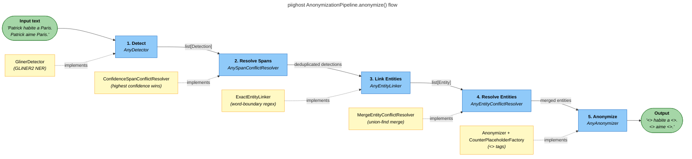
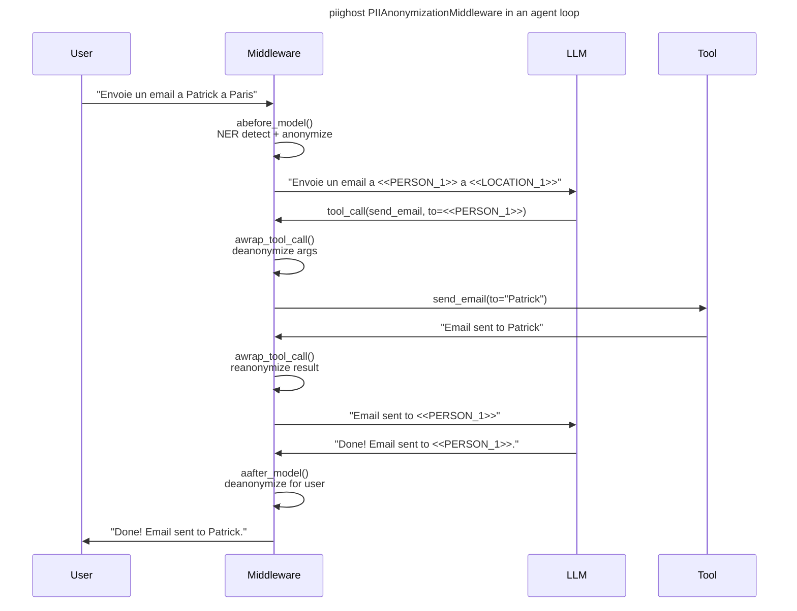

# PIIGhost


[](https://pytest.org/)
[](https://docs.astral.sh/uv/)
[](https://docs.astral.sh/ruff/)

`piighost` is a PII anonymization library for AI agent conversations. It transparently detects, anonymizes, and deanonymizes sensitive entities (names, locations, etc.) using [GLiNER2](https://github.com/knowledgator/gliner2) NER, with built-in LangChain middleware for seamless integration into LangGraph agents.

## Features

- **5-stage pipeline**: Detect → Resolve Spans → Link Entities → Resolve Entities → Anonymize covers every occurrence of each entity
- **Bidirectional**: reliable deanonymization via span-based replacement, plus fast string-based reanonymization
- **Conversation memory**: `ConversationMemory` accumulates entities across messages for consistent placeholders
- **LangChain middleware**: transparent hooks on `abefore_model`, `aafter_model`, and `awrap_tool_call` zero changes to your agent code
- **Protocol-based DI**: every pipeline stage is a swappable protocol detector, span resolver, entity linker, entity resolver, anonymizer, placeholder factory
- **Immutable data models**: frozen dataclasses throughout (`Entity`, `Detection`, `Span`)

## Installation

### Basic installation

This project uses [uv](https://docs.astral.sh/uv/) for dependency management.

```bash
uv add piighost
uv pip install piighost
```

### Development installation

Clone the repository and install with dev dependencies:

```bash
git clone https://github.com/Athroniaeth/piighost.git
cd piighost
uv sync
```

### Makefile helpers

Run the full lint suite with the provided Makefile:

```bash
make lint
```

This runs Ruff (format + lint) and PyReFly (type-check) through `uv run`.

## Quick start

### Standalone pipeline

```python
import asyncio

from piighost.anonymizer import Anonymizer
from piighost.detector import Gliner2Detector
from piighost.linker.entity import ExactEntityLinker
from piighost.entity_resolver import MergeEntityConflictResolver
from piighost.pipeline import AnonymizationPipeline
from piighost.placeholder import CounterPlaceholderFactory
from piighost.span_resolver import ConfidenceSpanConflictResolver

from gliner2 import GLiNER2

model = GLiNER2.from_pretrained("urchade/gliner_multi_pii-v1")

pipeline = AnonymizationPipeline(
    detector=Gliner2Detector(model=model, labels=["PERSON", "LOCATION"], threshold=0.5),
    span_resolver=ConfidenceSpanConflictResolver(),
    entity_linker=ExactEntityLinker(),
    entity_resolver=MergeEntityConflictResolver(),
    anonymizer=Anonymizer(CounterPlaceholderFactory()),
)


async def main():
    anonymized, entities = await pipeline.anonymize(
        "Patrick habite a Paris. Patrick aime Paris.",
    )
    print(anonymized)
    # <<PERSON_1>> habite a <<LOCATION_1>>. <<PERSON_1>> aime <<LOCATION_1>>.

    original, _ = await pipeline.deanonymize(anonymized)
    print(original)
    # Patrick habite a Paris. Patrick aime Paris.


asyncio.run(main())
```

### With LangChain middleware

```python
from langchain.agents import create_agent
from langchain_core.tools import tool

from piighost.anonymizer import Anonymizer
from piighost.conversation_memory import ConversationMemory
from piighost.conversation_pipeline import ConversationAnonymizationPipeline
from piighost.detector import Gliner2Detector
from piighost.linker.entity import ExactEntityLinker
from piighost.entity_resolver import MergeEntityConflictResolver
from piighost.middleware import PIIAnonymizationMiddleware
from piighost.placeholder import CounterPlaceholderFactory
from piighost.span_resolver import ConfidenceSpanConflictResolver


@tool
def send_email(to: str, subject: str, body: str) -> str:
    """Send an email to a given address."""
    return f"Email successfully sent to {to}."


pipeline = ConversationAnonymizationPipeline(
    detector=Gliner2Detector(model=model, labels=["PERSON", "LOCATION"], threshold=0.5),
    span_resolver=ConfidenceSpanConflictResolver(),
    entity_linker=ExactEntityLinker(),
    entity_resolver=MergeEntityConflictResolver(),
    anonymizer=Anonymizer(CounterPlaceholderFactory()),
    memory=ConversationMemory(),
)
middleware = PIIAnonymizationMiddleware(pipeline=pipeline)

graph = create_agent(
    model="openai:gpt-4",
    system_prompt="You are a helpful assistant.",
    tools=[send_email],
    middleware=[middleware],
)
```

The middleware intercepts every agent turn the LLM only sees anonymized text, tools receive real values, and user-facing messages are deanonymized automatically.

## How it works

### Anonymization pipeline



Each stage uses a **protocol** (structural subtyping) swap `GlinerDetector` for spaCy, a remote API, or an `ExactMatchDetector` for tests. Same for every other stage.

### Middleware integration



## Development

```bash
uv sync                      # Install dependencies
make lint                    # Format (ruff), lint (ruff), type-check (pyrefly)
uv run pytest                # Run all tests
uv run pytest tests/ -k "test_name"  # Run a single test
```

## Contributing

- **Commits**: Conventional Commits via Commitizen (`feat:`, `fix:`, `refactor:`, etc.)
- **Type checking**: PyReFly (not mypy)
- **Formatting/linting**: Ruff
- **Package manager**: uv (not pip)
- **Python**: 3.12+

## Additional notes

- The GLiNER2 model is downloaded from HuggingFace on first use (~500 MB)
- All data models are frozen dataclasses safe to share across threads
- Tests use `ExactMatchDetector` to avoid loading the real GLiNER2 model in CI
