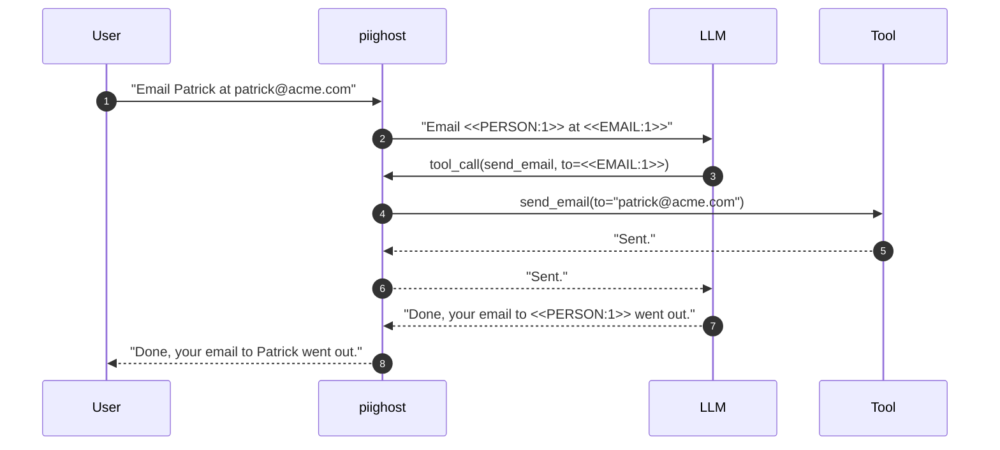
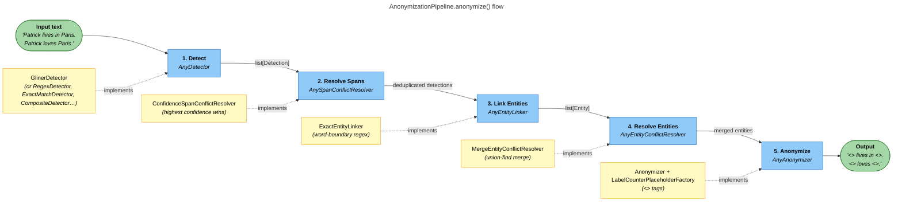

# PIIGhost

[](https://github.com/Athroniaeth/piighost/actions/workflows/ci.yml)
[](https://pypi.org/project/piighost/)
[](https://pypi.org/project/piighost/)
[](https://pypi.org/project/piighost/)
[](LICENSE)
[](https://athroniaeth.github.io/piighost/)
[](https://pytest.org/)
[](https://docs.astral.sh/ruff/)
[](https://github.com/PyCQA/bandit)

[README EN](README.md) - [README FR](README.fr.md)

`piighost` is a **composable PII anonymization pipeline** for LLM agents. Each stage (detect, link, resolve, anonymize) is a Python `Protocol` you can swap, so you keep control over your detectors (NER, regex, LLM, your own API) while `piighost` handles the hard parts: cross-message linking, placeholder consistency, and a LangChain middleware that anonymizes before the LLM and deanonymizes for tools and end users.



> The LLM only ever sees `<<PERSON:1>>` and `<<EMAIL:1>>`. Your `send_email` tool still receives the real address. The end user receives a deanonymized response. Zero changes to your agent code.

## Table of contents

- [Why piighost?](#why-piighost)
- [What makes this hard](#what-makes-this-hard)
- [Quick start](#quick-start)
- [Bring your own detector](#bring-your-own-detector)
- [Use cases](#use-cases)
- [How it works](#how-it-works)
  - [Pipeline](#pipeline)
  - [Middleware](#middleware-integration)
- [Installation](#installation)
- [Pipeline components](#pipeline-components)
- [FAQ](#faq)
- [Limitations](#limitations)
- [Development & contributing](#development)
- [Ecosystem](#ecosystem)
- [Star us!](#star-us)

## Why piighost?

When you ship an LLM feature, you usually pick one of three families of providers, and each one forces a trade-off:

- **Hosted non-EU clouds** (OpenAI, Anthropic, Google): the best models, but every byte of context, including raw user PII, leaves your jurisdiction.
- **EU-sovereign clouds** (Mistral AI, OVHcloud, Scaleway): legal guarantees on residency, but you give up some of the state of the art.
- **Self-hosted open weights**: total control, but you carry the infra cost and you stay further from the SOTA.

The only clean way to decouple the LLM from the sensitivity of the content is to **anonymize upstream**. Once PII never reaches the model, the choice of provider stops being a privacy decision and goes back to being a quality / cost / latency one. That's the slot `piighost` fills.

|                                           | **piighost**                                | LangChain                            | Microsoft Presidio | Regex              |
|-------------------------------------------|---------------------------------------------|--------------------------------------|--------------------|--------------------|
| Pluggable detectors (NER, regex, LLM, …)  | ✅ via `AnyDetector` protocol               | ⚠️ regex / Presidio only             | ⚠️ tied to spaCy/recognizers | ❌                |
| Compose multiple detectors                | ✅ `CompositeDetector` + span resolver      | ❌ one strategy per instance         | ⚠️ partial         | ❌                |
| Cross-message entity linking              | ✅ `ThreadAnonymizationPipeline` + memory   | ❌                                   | ❌                 | ❌                |
| Tolerates case / typo variants            | ✅ `ExactEntityLinker` + `FuzzyEntityResolver` | ❌                                | ❌                 | ❌                |
| Reversible anonymization (deanonymize)    | ✅ cache-backed                             | ❌ block / mask only                 | ⚠️ separate API    | ❌                |
| LangChain / LangGraph middleware          | ✅ `PIIAnonymizationMiddleware`             | ✅ `PIIMiddleware`                   | ❌                 | ❌                |
| Per-tool deanonymize / re-anonymize       | ✅ `awrap_tool_call`                        | ❌                                   | ❌                 | ❌                |
| Async-first API                           | ✅                                          | ⚠️                                   | ⚠️                 | ❌                |
| Bring-your-own placeholder format         | ✅ `AnyPlaceholderFactory`                  | ⚠️ template-only                     | ⚠️ template-only   | depends           |

LangChain's built-in [`PIIMiddleware`](https://docs.langchain.com/oss/python/langchain/middleware#pii-middleware) is the closest neighbour: it wires anonymization into the agent loop, but it is one-shot (block / redact / mask / hash) and can't deanonymize for end users or pass real values to tools. `piighost` keeps the same hook point and adds the round trip, the cross-message memory, and the swappable detection stack, so the LLM sees placeholders while the rest of the system keeps working with real data.

## What makes this hard

On paper, "replace names with tokens before the LLM call" is a one-liner. In practice, four problems show up immediately, and they are what shape the pipeline:

- **Placeholder consistency.** If `Patrick` is `<<PERSON:1>>` at line 1, every later mention of `Patrick` must stay `<<PERSON:1>>`. Restart the counter and the LLM thinks it's three different people.
- **Detector misses.** A NER model finds the full mention `Patrick Dupont` but skips a standalone `Patrick` two paragraphs later. The bare regex you'd add to compensate misses the variants. You need a layer that re-scans for known entities, not just raw NER output.
- **Span overlaps.** Run two detectors and they will sometimes claim the same offset with different labels (`PERSON` at confidence 0.95, `ORG` at 0.60). Without arbitration, span replacement walks over itself and you get garbled text.
- **Multi-message state.** Anonymize each message in isolation and you hit a silent collision: `Patrick` becomes `<<PERSON:1>>` in message 1, `Bob` becomes `<<PERSON:1>>` in message 2, both decode to the same person. Conversation memory is non-optional.

Each pipeline stage in `piighost` exists to fix one of those four. The 5-step architecture isn't theoretical, it's the smallest set that makes anonymization work end-to-end on real conversations.

## Quick start

Install the cache extra (used by the pipeline):

```bash
uv add 'piighost[cache]'
```

Anonymize and deanonymize without downloading any model. The `ExactMatchDetector` matches a fixed dictionary by word-boundary regex, ideal to try `piighost` in under a minute.

```python
import asyncio
from pprint import pp

from piighost import Anonymizer, ExactMatchDetector
from piighost.pipeline import AnonymizationPipeline

detector = ExactMatchDetector([("Patrick", "PERSON"), ("Paris", "LOCATION")])
pipeline = AnonymizationPipeline(detector=detector, anonymizer=Anonymizer())


async def main() -> None:
    anonymized, entities = await pipeline.anonymize("Patrick lives in Paris.")
    print(anonymized)
    # <<PERSON:1>> lives in <<LOCATION:1>>.

    pp(entities)
    # [
    #     Entity(detections=(
    #         Detection(
    #             text='Patrick',
    #             label='PERSON',
    #             position=Span(start_pos=0, end_pos=7),
    #             confidence=1.0,
    #         ),
    #     )),
    #     Entity(detections=(
    #         Detection(
    #             text='Paris',
    #             label='LOCATION',
    #             position=Span(start_pos=17, end_pos=22),
    #             confidence=1.0,
    #         ),
    #     )),
    # ]

    original, restored = await pipeline.deanonymize(anonymized)
    print(original)
    # Patrick lives in Paris.

    pp(restored)
    # [
    #     Entity(detections=(
    #         Detection(
    #             text='Patrick',
    #             label='PERSON',
    #             position=Span(start_pos=0, end_pos=7),
    #             confidence=1.0,
    #         ),
    #     )),
    #     Entity(detections=(
    #         Detection(
    #             text='Paris',
    #             label='LOCATION',
    #             position=Span(start_pos=17, end_pos=22),
    #             confidence=1.0,
    #         ),
    #     )),
    # ]


asyncio.run(main())
```

> Both `anonymize` and `deanonymize` return `(text, list[Entity])`: the entities come straight from the cache, no re-detection. Note that an `Entity` does **not** carry its placeholder: the placeholder is regenerated on the fly by the `PlaceholderFactory` from the ordered list of entities. That's how counter-style factories such as `LabelCounterPlaceholderFactory` produce stable `<<PERSON:1>>`, `<<PERSON:2>>`, ... numbers across `anonymize` and `deanonymize` (the order is the source of truth). The `text` field of `Detection` is rendered verbatim by the standard dataclass `repr`, scrub it yourself if you forward these objects to logs (see [docs/en/security.md](docs/en/security.md)).

> **How does `deanonymize` know the original?** It does not re-run the detector. The pipeline keeps an in-memory cache (`aiocache.SimpleMemoryCache` by default) that maps `sha256(anonymized_text) → (original_text, entities)`. Calling `deanonymize` is just a lookup. For multi-instance deployments, swap in a Redis or Memcached backend, see [docs/en/deployment.md](docs/en/deployment.md).

For real workloads, plug in a NER model or your own detector below.

<details>
<summary><strong>Advanced configuration</strong> (real NER, custom resolvers, full pipeline)</summary>

```python
import asyncio
from gliner2 import GLiNER2

from piighost.anonymizer import Anonymizer
from piighost.detector.gliner2 import Gliner2Detector
from piighost.pipeline import AnonymizationPipeline

model = GLiNER2.from_pretrained("fastino/gliner2-multi-v1")
detector = Gliner2Detector(model=model, labels=["PERSON", "LOCATION"])
pipeline = AnonymizationPipeline(detector=detector, anonymizer=Anonymizer())


async def main() -> None:
    text = "Patrick lives in Paris. Patrick loves Paris."
    anonymized, entities = await pipeline.anonymize(text)
    print(anonymized)
    # <<PERSON:1>> lives in <<LOCATION:1>>. <<PERSON:1>> loves <<LOCATION:1>>.

    for entity in entities:
        print(f"  {entity.label}: {entity.detections[0].text}")
    # PERSON: Patrick
    # LOCATION: Paris

    original, _ = await pipeline.deanonymize(anonymized)
    print(original)
    # Patrick lives in Paris. Patrick loves Paris.


asyncio.run(main())
```

Swap `Gliner2Detector` for any other implementation of `AnyDetector` (spaCy, regex, a remote API, your own, see [Bring your own detector](#bring-your-own-detector)). Same for every other stage of the pipeline.

</details>

### With LangChain agent middleware

A LangChain middleware is an extension point that runs before and after every LLM call and every tool call. `piighost` hooks into it to intercept and transform messages, so PII anonymization is applied without changing your agent code.

```python
from langchain.agents import create_agent
from langchain_core.tools import tool

from piighost.anonymizer import Anonymizer
from piighost.detector.gliner2 import Gliner2Detector
from piighost.pipeline import ThreadAnonymizationPipeline
from piighost.middleware import PIIAnonymizationMiddleware

from gliner2 import GLiNER2


@tool
def send_email(to: str, subject: str, body: str) -> str:
    """Send an email to a given address."""
    return f"Email successfully sent to {to}."


model = GLiNER2.from_pretrained("fastino/gliner2-multi-v1")
detector = Gliner2Detector(model=model, labels=["PERSON", "LOCATION"])
pipeline = ThreadAnonymizationPipeline(detector=detector, anonymizer=Anonymizer())
middleware = PIIAnonymizationMiddleware(pipeline=pipeline)

graph = create_agent(
    model="openai:gpt-5.4",
    system_prompt="You are a helpful assistant.",
    tools=[send_email],
    middleware=[middleware],
)
```

The middleware intercepts every agent turn: the LLM only sees anonymized text, tools receive real values, and user-facing messages are deanonymized automatically.

## Bring your own detector

The detection stage is just a `Protocol`. Anything async with a `detect(text) -> list[Detection]` method works. The pipeline does not care whether it's a model, a regex, or an HTTP call.

```python
import httpx

from piighost.detector.base import AnyDetector  # protocol, structural typing
from piighost.models import Detection, Span


class RemoteNERDetector:
    """Calls a hosted NER service and maps its response to Detection objects."""

    def __init__(self, url: str, api_key: str) -> None:
        self._url, self._key = url, api_key

    async def detect(self, text: str) -> list[Detection]:
        async with httpx.AsyncClient() as client:
            r = await client.post(
                self._url,
                json={"text": text},
                headers={"Authorization": f"Bearer {self._key}"},
            )
        return [
            Detection(
                text=hit["text"],
                label=hit["label"],
                position=Span(start_pos=hit["start"], end_pos=hit["end"]),
                confidence=hit["score"],
            )
            for hit in r.json()["entities"]
        ]


# Satisfies AnyDetector by structural typing — drop it straight into the pipeline.
detector: AnyDetector = RemoteNERDetector(url="...", api_key="...")
```

Combine several detectors with `CompositeDetector` and let `ConfidenceSpanConflictResolver` pick a winner when their spans overlap. See [docs/en/extending.md](docs/en/extending.md) for the full catalogue (spaCy, transformers, LLM-as-detector, regex with validators for IBAN / NIR / Luhn).

## Use cases

`piighost` fits anywhere a third-party LLM should not see real names, identifiers, or free-text PII:

- **Customer support chatbot.** A SaaS sends every ticket to GPT to generate a draft reply. With `piighost`, the LLM sees `<<CUSTOMER:1>> reports an outage on order <<ORDER_ID:3>>`, the response comes back deanonymized, and the customer email is never logged on the provider side.
- **Healthcare / clinical assistant.** A nurse pastes patient notes into a triage assistant. `piighost` strips patient names, SSN, and addresses before the LLM call, while the medical content (symptoms, vitals, treatments) reaches the model intact, which keeps reasoning quality high while avoiding a HIPAA / GDPR incident.
- **HR agent on internal documents.** A RAG agent answers questions over performance reviews and salary grids. Employee names and amounts are anonymized in retrieved chunks; the LLM never sees who got what; the final answer is reconstructed for the authorized HR user only.
- **Legal assistant.** Contracts processed with client and counterparty names redacted before reaching the model.
- **Tool-enabled agents.** Anonymize free-text inputs without breaking tool calls: the `send_email` / CRM / Jira tool still receives the real address, the LLM only ever saw `<<PERSON:1>>`.

## How it works

### Pipeline

`AnonymizationPipeline` runs five stages, each one a swappable protocol:



> Three terms drive the pipeline: a **span** is a `(start, end)` offset, a **detection** is a span + label + confidence emitted by a detector, an **entity** is a group of detections referring to the same real-world PII (so they share the same placeholder). Full definitions in the [glossary](docs/en/glossary.md).

### Middleware integration

The middleware hooks into LangChain's `abefore_model`, `awrap_tool_call` and `aafter_model` to anonymize, deanonymize for tools, and re-anonymize tool results. See [docs/en/architecture.md](docs/en/architecture.md) for the full sequence.

## Installation

`piighost` ships as a regular wheel on PyPI. The core package has no required dependencies, install only the extras for the features you need.

### Inside a uv project (recommended)

```bash
uv add piighost                 # core only (small, no model)
uv add 'piighost[cache]'        # AnonymizationPipeline (aiocache)
uv add 'piighost[gliner2]'      # Gliner2Detector
uv add 'piighost[middleware]'   # PIIAnonymizationMiddleware (langchain + aiocache)
uv add 'piighost[all]'          # everything
```

### Standalone (pip or `uv pip`)

For an isolated venv, a notebook, or a script outside a uv project:

```bash
pip install piighost                          # or:  uv pip install piighost
pip install 'piighost[middleware]'
```

### Compatibility

| Python  | LangChain (extra `middleware`) | aiocache (extra `cache`) | GLiNER2 (extra `gliner2`) |
|---------|-------------------------------|--------------------------|---------------------------|
| >=3.10  | >=1.2                         | >=0.12                   | >=1.2                     |

`piighost` is tested on Python 3.10 through 3.14. Versions are declared in [`pyproject.toml`](pyproject.toml).

### From source (development)

```bash
git clone https://github.com/Athroniaeth/piighost.git
cd piighost
uv sync
make lint        # ruff format + check, pyrefly type-check, bandit
uv run pytest
```

## Pipeline components

Only `detector` and `anonymizer` are required, the three middle stages (span resolver, entity linker, entity resolver) have sensible defaults you can override. Full table of defaults, roles, and what each stage protects against in [docs/en/architecture.md](docs/en/architecture.md).

## FAQ

**Q: What languages are supported?**
That's entirely up to the detector you plug in. The pipeline itself is language-agnostic. With `Gliner2Detector` and a multilingual GLiNER2 model, you get ~100 languages out of the box. With `SpacyDetector`, anything spaCy supports. With `RegexDetector`, language doesn't matter.

**Q: Which entities does it detect out of the box?**
None: `piighost` does not ship its own NER model, on purpose. You bring the detector. Use `ExactMatchDetector` for fixed dictionaries, `RegexDetector` with `piighost.detector.patterns` (FR_IBAN, FR_NIR, EU_VAT, ...), `Gliner2Detector` for open-set NER (`PERSON`, `LOCATION`, `ORGANIZATION`, `EMAIL`, ... whatever labels you query), or compose them.

**Q: How much latency does it add?**
The pipeline itself is ~milliseconds (regex + dict lookups). Real cost is the detector you choose. CPU GLiNER2 on a 200-token message is typically 50-200 ms; an LLM-as-detector is hundreds of ms. The pipeline caches detection results per text hash via `aiocache`, so repeated content is free. Benchmarks for your own workload are recommended before sizing production traffic.

**Q: Does it work fully offline? (GDPR / RGPD)**
Yes. With a local detector (`Gliner2Detector`, `SpacyDetector`, `RegexDetector`, `ExactMatchDetector`), no data leaves your process. The middleware only forwards already-anonymized text to the LLM. This is the main reason teams adopt `piighost`: keep using a hosted LLM under EU constraints without exfiltrating raw PII.

**Q: What happens when the NER misses an entity?**
Two layers of defense:
1. The **entity linker** scans the whole text (and the conversation, in `ThreadAnonymizationPipeline`) for word-level matches of every detected entity. So if `Patrick` is detected once, every other `Patrick` in the text gets the same placeholder, even if the NER missed them.
2. For deterministic PII (emails, phone numbers, IBANs), combine the NER detector with a `RegexDetector` via `CompositeDetector`. NER false negatives become regex true positives.

For PII the LLM **generates** in its response (entities never seen in the input), use a `DetectorGuardRail` on the output, see [docs/en/extending.md](docs/en/extending.md).

**Q: Can I use it without LangChain?**
Yes. `AnonymizationPipeline` and `ThreadAnonymizationPipeline` are independent of any agent framework. The LangChain middleware is one integration; the pipeline itself can be called from anywhere (FastAPI handler, batch script, custom agent loop).

**Q: How is reversibility (deanonymize) implemented?**
A SHA-256 keyed cache stores `anonymized_text → (original_text, entities)`. `pipeline.deanonymize(anonymized_text)` looks up the mapping and restores the original. The cache is in-memory by default (`SimpleMemoryCache`), pass any `aiocache` backend (Redis, Memcached) for multi-instance deployments.

## Limitations

`piighost` is not a silver bullet. Trade-offs to keep in mind before deploying:

- **Entity linking amplifies NER mistakes.** If `Rose` is mistakenly detected as a person, every `rose` (the flower) is anonymized too. Mitigation: narrower detector (`ExactMatchDetector`, `RegexDetector`), or fresh thread per message.
- **Fuzzy resolution can over-merge.** Jaro-Winkler on short names (`Marin` vs `Martin`) can fuse distinct people. Mitigation: raise the threshold or stick to `MergeEntityConflictResolver`.
- **PII generated by the LLM in its responses** (never seen in input) bypasses entity linking. Add a `DetectorGuardRail` on the output.
- **Cache is local** by default. Multi-instance deployments need a shared backend (Redis, Memcached) configured explicitly.
- **Latency overhead is detector-bound.** Benchmark on your own workload before sizing production traffic.

See [docs/en/architecture.md](docs/en/architecture.md), [docs/en/extending.md](docs/en/extending.md), and [docs/en/limitations.md](docs/en/limitations.md) for mitigation strategies.

## Development

```bash
uv sync                              # install dev dependencies
make lint                            # ruff format + check, pyrefly, bandit
uv run pytest                        # run all tests
uv run pytest tests/ -k "test_name"  # run a single test
```

### Contributing

- **Commits**: Conventional Commits via Commitizen (`feat:`, `fix:`, `refactor:`, ...)
- **Type checking**: PyReFly (not mypy)
- **Formatting / linting**: Ruff
- **Package manager**: uv (not pip)
- **Python**: 3.10+

See [CONTRIBUTING.md](CONTRIBUTING.md) and [CODE_OF_CONDUCT.md](CODE_OF_CONDUCT.md).

## Ecosystem

- **[piighost-api](https://github.com/Athroniaeth/piighost-api)**: REST API server for PII anonymization inference. Loads a piighost pipeline once server-side and exposes `anonymize` / `deanonymize` over HTTP, so clients only need a lightweight HTTP client instead of embedding the NER model.
- **[piighost-chat](https://github.com/Athroniaeth/piighost-chat)**: Demo chat app showcasing privacy-preserving AI conversations. Uses `PIIAnonymizationMiddleware` with LangChain to anonymize messages before the LLM and deanonymize responses transparently. Built with SvelteKit, Litestar, and Docker Compose.

## Additional notes

- All data models are frozen dataclasses, safe to share across threads.
- Tests use `ExactMatchDetector` to avoid loading any heavy NER model in CI.
- For the threat model, what `piighost` protects against and what it does not, and cache storage considerations, see [SECURITY.md](SECURITY.md).

## Roadmap

A public roadmap (logo, latency / accuracy benchmarks on a reference corpus, GIF demo of `piighost-chat`, hosted live demo) lives in [docs/en/roadmap.md](docs/en/roadmap.md). Issues and discussions welcome.

## Star us!

If `piighost` saves you a few hours, a ⭐ on [GitHub](https://github.com/Athroniaeth/piighost) helps others find it. Bug reports and PRs are even better, see [CONTRIBUTING.md](CONTRIBUTING.md).
