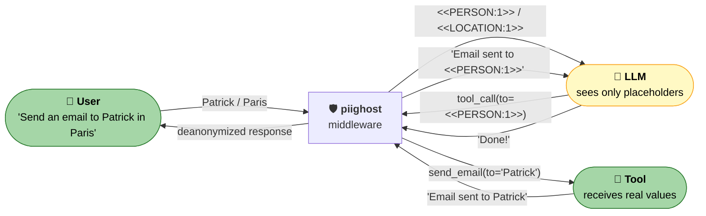
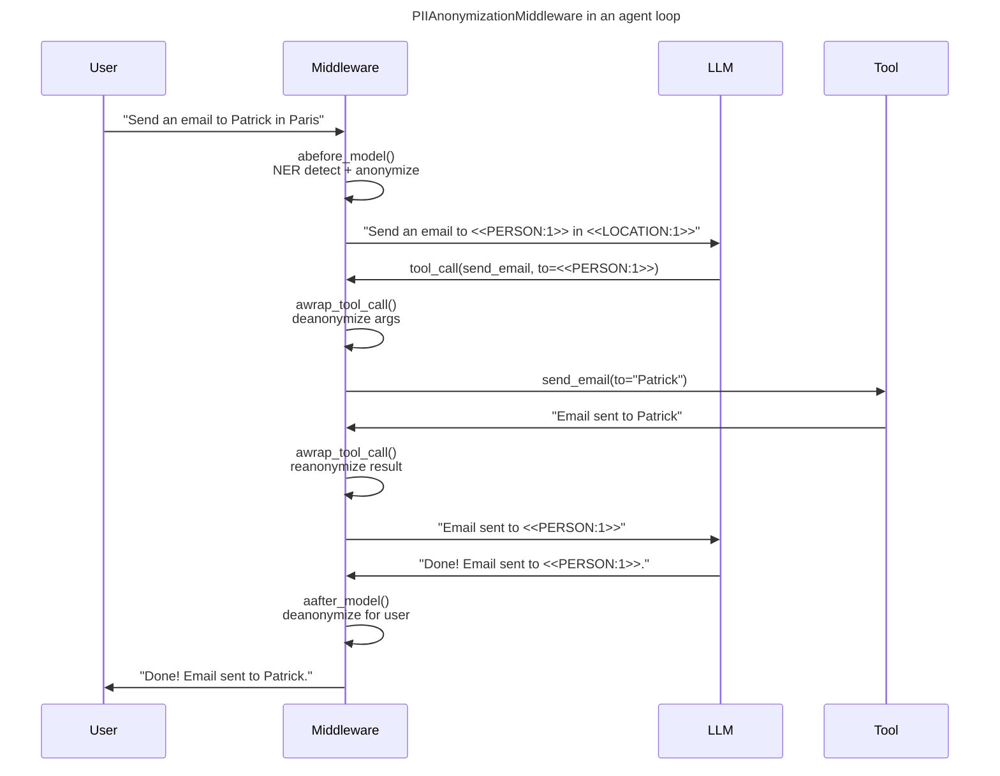

# PIIGhost

[](https://github.com/Athroniaeth/piighost/actions/workflows/ci.yml)
[](https://pypi.org/project/piighost/)
[](https://pypi.org/project/piighost/)
[](https://pypi.org/project/piighost/)
[](LICENSE)
[](https://athroniaeth.github.io/piighost/)
[](https://pytest.org/)
[](https://docs.astral.sh/ruff/)
[](https://github.com/PyCQA/bandit)

[README EN](README.md) - [README FR](README.fr.md)

`piighost` is a **composable PII anonymization pipeline** for LLM agents. Each stage (detect, link, resolve, anonymize) is a Python `Protocol` you can swap, so you keep control over your detectors (NER, regex, LLM, your own API) while `piighost` handles the hard parts: cross-message linking, placeholder consistency, and a LangChain middleware that anonymizes before the LLM and deanonymizes for tools and end users.



> The LLM never sees `Patrick` or `Paris`, but your `send_email` tool still receives real values. End users get a fully deanonymized response. Zero changes to your agent code.

## Table of contents

- [Why piighost?](#why-piighost)
- [Quick start](#quick-start)
- [Bring your own detector](#bring-your-own-detector)
- [Use cases](#use-cases)
- [How it works](#how-it-works)
  - [Pipeline](#pipeline)
  - [Glossary: detection, span, entity](#glossary-detection-span-entity)
  - [Middleware](#middleware-integration)
- [Installation](#installation)
- [Pipeline components](#pipeline-components)
- [FAQ](#faq)
- [Limitations](#limitations)
- [Development & contributing](#development)
- [Ecosystem](#ecosystem)
- [Star us!](#star-us)

## Why piighost?

|                                           | **piighost**                                | Microsoft Presidio | Regex / hand-rolled |
|-------------------------------------------|---------------------------------------------|--------------------|---------------------|
| Pluggable detectors (NER, regex, LLM, …)  | ✅ via `AnyDetector` protocol               | ⚠️ tied to spaCy/recognizers | ❌                  |
| Compose multiple detectors                | ✅ `CompositeDetector` + span resolver      | ⚠️ partial         | ❌                  |
| Cross-message entity linking              | ✅ `ThreadAnonymizationPipeline` + memory   | ❌                 | ❌                  |
| Tolerates case / typo variants            | ✅ `ExactEntityLinker` + `FuzzyEntityResolver` | ❌              | ❌                  |
| Reversible anonymization (deanonymize)    | ✅ cache-backed                             | ⚠️ separate API    | ❌                  |
| LangChain / LangGraph middleware (native) | ✅ `PIIAnonymizationMiddleware`             | ❌                 | ❌                  |
| Per-tool deanonymize / re-anonymize       | ✅ `awrap_tool_call`                        | ❌                 | ❌                  |
| Async-first API                           | ✅                                          | ⚠️                 | ❌                  |
| Bring-your-own placeholder format         | ✅ `AnyPlaceholderFactory`                  | ⚠️ template-only   | depends             |

The real differentiator is **not the underlying NER**: it's the modular pipeline and the LangGraph-native middleware that turn any detector into a production-grade anonymization layer for AI agents.

## Quick start

Install the cache extra (used by the pipeline):

```bash
uv add 'piighost[cache]'
```

Anonymize and deanonymize without downloading any model. The `ExactMatchDetector` matches a fixed dictionary by word-boundary regex, ideal to try `piighost` in under a minute.

```python
import asyncio

from piighost import Anonymizer, ExactMatchDetector
from piighost.pipeline import AnonymizationPipeline

detector = ExactMatchDetector([("Patrick", "PERSON"), ("Paris", "LOCATION")])
pipeline = AnonymizationPipeline(detector=detector, anonymizer=Anonymizer())


async def main() -> None:
    text, entities = await pipeline.anonymize("Patrick lives in Paris.")
    print(text)
    # <<PERSON:1>> lives in <<LOCATION:1>>.

    for entity in entities:
        print(f"  {entity.label}: {entity.detections[0].text}")
    # PERSON: Patrick
    # LOCATION: Paris


asyncio.run(main())
```

For real workloads, plug in a NER model or your own detector below.

<details>
<summary><strong>Advanced configuration</strong> (real NER, custom resolvers, full pipeline)</summary>

```python
import asyncio
from gliner2 import GLiNER2

from piighost.anonymizer import Anonymizer
from piighost.detector.gliner2 import Gliner2Detector
from piighost.pipeline import AnonymizationPipeline

model = GLiNER2.from_pretrained("fastino/gliner2-multi-v1")
detector = Gliner2Detector(model=model, labels=["PERSON", "LOCATION"])
pipeline = AnonymizationPipeline(detector=detector, anonymizer=Anonymizer())


async def main() -> None:
    text = "Patrick lives in Paris. Patrick loves Paris."
    anonymized, entities = await pipeline.anonymize(text)
    print(anonymized)
    # <<PERSON:1>> lives in <<LOCATION:1>>. <<PERSON:1>> loves <<LOCATION:1>>.

    for entity in entities:
        print(f"  {entity.label}: {entity.detections[0].text}")
    # PERSON: Patrick
    # LOCATION: Paris

    original, _ = await pipeline.deanonymize(anonymized)
    print(original)
    # Patrick lives in Paris. Patrick loves Paris.


asyncio.run(main())
```

Swap `Gliner2Detector` for any other implementation of `AnyDetector` (spaCy, regex, a remote API, your own, see [Bring your own detector](#bring-your-own-detector)). Same for every other stage of the pipeline.

</details>

### With LangChain agent middleware

A LangChain middleware is an extension point that runs before and after every LLM call and every tool call. `piighost` hooks into it to intercept and transform messages, so PII anonymization is applied without changing your agent code.

```python
from langchain.agents import create_agent
from langchain_core.tools import tool

from piighost.anonymizer import Anonymizer
from piighost.detector.gliner2 import Gliner2Detector
from piighost.pipeline import ThreadAnonymizationPipeline
from piighost.middleware import PIIAnonymizationMiddleware

from gliner2 import GLiNER2


@tool
def send_email(to: str, subject: str, body: str) -> str:
    """Send an email to a given address."""
    return f"Email successfully sent to {to}."


model = GLiNER2.from_pretrained("fastino/gliner2-multi-v1")
detector = Gliner2Detector(model=model, labels=["PERSON", "LOCATION"])
pipeline = ThreadAnonymizationPipeline(detector=detector, anonymizer=Anonymizer())
middleware = PIIAnonymizationMiddleware(pipeline=pipeline)

graph = create_agent(
    model="openai:gpt-5.4",
    system_prompt="You are a helpful assistant.",
    tools=[send_email],
    middleware=[middleware],
)
```

The middleware intercepts every agent turn: the LLM only sees anonymized text, tools receive real values, and user-facing messages are deanonymized automatically.

## Bring your own detector

The detection stage is just a `Protocol`. Anything async with a `detect(text) -> list[Detection]` method works. The pipeline doesn't care whether it's a model, a regex, an HTTP call, or all three.

```python
import re
import httpx

from piighost.detector.base import AnyDetector  # protocol, structural typing
from piighost.models import Detection, Span


# 1. Wrap a remote API
class RemoteNERDetector:
    """Calls a hosted NER service and maps its response to Detection objects."""

    def __init__(self, url: str, api_key: str) -> None:
        self._url, self._key = url, api_key

    async def detect(self, text: str) -> list[Detection]:
        async with httpx.AsyncClient() as client:
            r = await client.post(
                self._url,
                json={"text": text},
                headers={"Authorization": f"Bearer {self._key}"},
            )
        return [
            Detection(
                text=hit["text"],
                label=hit["label"],
                position=Span(start_pos=hit["start"], end_pos=hit["end"]),
                confidence=hit["score"],
            )
            for hit in r.json()["entities"]
        ]


# 2. Or just a regex you trust
class IbanDetector:
    _PATTERN = re.compile(r"\b[A-Z]{2}\d{2}[A-Z0-9]{4}\d{7}([A-Z0-9]?){0,16}\b")

    async def detect(self, text: str) -> list[Detection]:
        return [
            Detection(
                text=m.group(),
                label="IBAN",
                position=Span(m.start(), m.end()),
                confidence=1.0,
            )
            for m in self._PATTERN.finditer(text)
        ]


# Both satisfy AnyDetector by structural typing — drop them straight into the pipeline.
detectors: list[AnyDetector] = [RemoteNERDetector(...), IbanDetector()]
```

Combine several detectors with `CompositeDetector` and let `ConfidenceSpanConflictResolver` pick a winner when their spans overlap. See [docs/en/extending.md](docs/en/extending.md) for full examples (spaCy, transformers, LLM-as-detector).

## Use cases

`piighost` fits anywhere a third-party LLM should not see real names, identifiers, or free-text PII:

- **Customer support chatbot.** A SaaS sends every ticket to GPT to generate a draft reply. With `piighost`, the LLM sees `<<CUSTOMER:1>> reports an outage on order <<ORDER_ID:3>>`, the response comes back deanonymized, and the customer email is never logged on the provider side.
- **Healthcare / clinical assistant.** A nurse pastes patient notes into a triage assistant. `piighost` strips patient names, SSN, and addresses before the LLM call, while the medical content (symptoms, vitals, treatments) reaches the model intact, which keeps reasoning quality high while avoiding a HIPAA / GDPR incident.
- **HR agent on internal documents.** A RAG agent answers questions over performance reviews and salary grids. Employee names and amounts are anonymized in retrieved chunks; the LLM never sees who got what; the final answer is reconstructed for the authorized HR user only.
- **Legal assistant.** Contracts processed with client and counterparty names redacted before reaching the model.
- **Tool-enabled agents.** Anonymize free-text inputs without breaking tool calls: the `send_email` / CRM / Jira tool still receives the real address, the LLM only ever saw `<<PERSON:1>>`.

## How it works

### Pipeline

`AnonymizationPipeline` runs five stages, each one a swappable protocol:


### Glossary: detection, span, entity

These three terms drive the pipeline. They sound similar but mean different things:

- **Span**: a `(start, end)` character offset inside the text. `Patrick lives in Paris.` contains the span `(0, 7)` for `Patrick` and `(17, 22)` for `Paris`.
- **Detection**: a single hit from a detector. It's a span plus a `label` (`"PERSON"`) and a `confidence`. One detector run on `Patrick lives in Paris. Patrick loves Paris.` produces **four** detections (two for `Patrick`, two for `Paris`).
- **Entity**: a group of detections that refer to the same real-world thing. The entity linker collapses the four detections above into **two** entities (`Patrick` and `Paris`), so they get the same placeholder in every occurrence.

Why it matters: a detector that returns overlapping spans (e.g., `New York` and `York` both flagged) is fine, the span resolver picks one. A detector that misses an occurrence is fine too, the entity linker re-scans the text and groups by exact word match. Both behaviors are tweakable via the protocols.

### Middleware integration



## Installation

`piighost` ships as a regular wheel on PyPI. The core package has no required dependencies, install only the extras for the features you need.

### Inside a uv project (recommended)

```bash
uv add piighost                 # core only (small, no model)
uv add 'piighost[cache]'        # AnonymizationPipeline (aiocache)
uv add 'piighost[gliner2]'      # Gliner2Detector
uv add 'piighost[middleware]'   # PIIAnonymizationMiddleware (langchain + aiocache)
uv add 'piighost[all]'          # everything
```

### Standalone (pip or `uv pip`)

For an isolated venv, a notebook, or a script outside a uv project:

```bash
pip install piighost                          # or:  uv pip install piighost
pip install 'piighost[middleware]'
```

### Compatibility

| Python  | LangChain (extra `middleware`) | aiocache (extra `cache`) | GLiNER2 (extra `gliner2`) |
|---------|-------------------------------|--------------------------|---------------------------|
| >=3.10  | >=1.2                         | >=0.12                   | >=1.2                     |

`piighost` is tested on Python 3.10 through 3.14. Versions are declared in [`pyproject.toml`](pyproject.toml).

### From source (development)

```bash
git clone https://github.com/Athroniaeth/piighost.git
cd piighost
uv sync
make lint        # ruff format + check, pyrefly type-check, bandit
uv run pytest
```

## Pipeline components

The pipeline runs 5 stages. Only `detector` and `anonymizer` are required, the others have sensible defaults:

| Stage | Default | Role | Without it |
|-------|---------|------|------------|
| **Detect** | *(required)* | Finds PII spans via NER | - |
| **Resolve Spans** | `ConfidenceSpanConflictResolver` | Deduplicates overlapping detections (keeps highest confidence) | Overlapping spans from multiple detectors cause garbled replacements |
| **Link Entities** | `ExactEntityLinker` | Finds all occurrences of each entity via word-boundary regex | Only NER-detected mentions are anonymized; other occurrences leak through |
| **Resolve Entities** | `MergeEntityConflictResolver` | Merges entity groups that share a mention (union-find) | Same entity could get two different placeholders |
| **Anonymize** | *(required)* | Replaces entities with placeholders (`<<PERSON:1>>`) | - |

Each stage is a **protocol**: swap any default for your own implementation.

## FAQ

**Q: What languages are supported?**
That's entirely up to the detector you plug in. The pipeline itself is language-agnostic. With `Gliner2Detector` and a multilingual GLiNER2 model, you get ~100 languages out of the box. With `SpacyDetector`, anything spaCy supports. With `RegexDetector`, language doesn't matter.

**Q: Which entities does it detect out of the box?**
None: `piighost` does not ship its own NER model, on purpose. You bring the detector. Use `ExactMatchDetector` for fixed dictionaries, `RegexDetector` with `piighost.detector.patterns` (FR_IBAN, FR_NIR, EU_VAT, ...), `Gliner2Detector` for open-set NER (`PERSON`, `LOCATION`, `ORGANIZATION`, `EMAIL`, ... whatever labels you query), or compose them.

**Q: How much latency does it add?**
The pipeline itself is ~milliseconds (regex + dict lookups). Real cost is the detector you choose. CPU GLiNER2 on a 200-token message is typically 50-200 ms; an LLM-as-detector is hundreds of ms. The pipeline caches detection results per text hash via `aiocache`, so repeated content is free. Benchmarks for your own workload are recommended before sizing production traffic.

**Q: Does it work fully offline? (GDPR / RGPD)**
Yes. With a local detector (`Gliner2Detector`, `SpacyDetector`, `RegexDetector`, `ExactMatchDetector`), no data leaves your process. The middleware only forwards already-anonymized text to the LLM. This is the main reason teams adopt `piighost`: keep using a hosted LLM under EU constraints without exfiltrating raw PII.

**Q: What happens when the NER misses an entity?**
Two layers of defense:
1. The **entity linker** scans the whole text (and the conversation, in `ThreadAnonymizationPipeline`) for word-level matches of every detected entity. So if `Patrick` is detected once, every other `Patrick` in the text gets the same placeholder, even if the NER missed them.
2. For deterministic PII (emails, phone numbers, IBANs), combine the NER detector with a `RegexDetector` via `CompositeDetector`. NER false negatives become regex true positives.

For PII the LLM **generates** in its response (entities never seen in the input), use a `DetectorGuardRail` on the output, see [docs/en/extending.md](docs/en/extending.md).

**Q: Can I use it without LangChain?**
Yes. `AnonymizationPipeline` and `ThreadAnonymizationPipeline` are independent of any agent framework. The LangChain middleware is one integration; the pipeline itself can be called from anywhere (FastAPI handler, batch script, custom agent loop).

**Q: How is reversibility (deanonymize) implemented?**
A SHA-256 keyed cache stores `anonymized_text → (original_text, entities)`. `pipeline.deanonymize(anonymized_text)` looks up the mapping and restores the original. The cache is in-memory by default (`SimpleMemoryCache`), pass any `aiocache` backend (Redis, Memcached) for multi-instance deployments.

## Limitations

`piighost` is not a silver bullet. Trade-offs to keep in mind before deploying:

- **Entity linking amplifies NER mistakes.** If `Rose` is mistakenly detected as a person, every `rose` (the flower) is anonymized too. Mitigation: narrower detector (`ExactMatchDetector`, `RegexDetector`), or fresh thread per message.
- **Fuzzy resolution can over-merge.** Jaro-Winkler on short names (`Marin` vs `Martin`) can fuse distinct people. Mitigation: raise the threshold or stick to `MergeEntityConflictResolver`.
- **PII generated by the LLM in its responses** (never seen in input) bypasses entity linking. Add a `DetectorGuardRail` on the output.
- **Cache is local** by default. Multi-instance deployments need a shared backend (Redis, Memcached) configured explicitly.
- **Latency overhead is detector-bound.** Benchmark on your own workload before sizing production traffic.

See [docs/en/architecture.md](docs/en/architecture.md), [docs/en/extending.md](docs/en/extending.md), and [docs/en/limitations.md](docs/en/limitations.md) for mitigation strategies.

## Development

```bash
uv sync                              # install dev dependencies
make lint                            # ruff format + check, pyrefly, bandit
uv run pytest                        # run all tests
uv run pytest tests/ -k "test_name"  # run a single test
```

### Contributing

- **Commits**: Conventional Commits via Commitizen (`feat:`, `fix:`, `refactor:`, ...)
- **Type checking**: PyReFly (not mypy)
- **Formatting / linting**: Ruff
- **Package manager**: uv (not pip)
- **Python**: 3.10+

See [CONTRIBUTING.md](CONTRIBUTING.md) and [CODE_OF_CONDUCT.md](CODE_OF_CONDUCT.md).

## Ecosystem

- **[piighost-api](https://github.com/Athroniaeth/piighost-api)**: REST API server for PII anonymization inference. Loads a piighost pipeline once server-side and exposes `anonymize` / `deanonymize` over HTTP, so clients only need a lightweight HTTP client instead of embedding the NER model.
- **[piighost-chat](https://github.com/Athroniaeth/piighost-chat)**: Demo chat app showcasing privacy-preserving AI conversations. Uses `PIIAnonymizationMiddleware` with LangChain to anonymize messages before the LLM and deanonymize responses transparently. Built with SvelteKit, Litestar, and Docker Compose.

## Additional notes

- All data models are frozen dataclasses, safe to share across threads.
- Tests use `ExactMatchDetector` to avoid loading any heavy NER model in CI.
- For the threat model, what `piighost` protects against and what it does not, and cache storage considerations, see [SECURITY.md](SECURITY.md).

## Roadmap

A public roadmap (logo, latency / accuracy benchmarks on a reference corpus, GIF demo of `piighost-chat`, hosted live demo) lives in [docs/en/roadmap.md](docs/en/roadmap.md). Issues and discussions welcome.

## Star us!

If `piighost` saves you a few hours, a ⭐ on [GitHub](https://github.com/Athroniaeth/piighost) helps others find it. Bug reports and PRs are even better, see [CONTRIBUTING.md](CONTRIBUTING.md).
