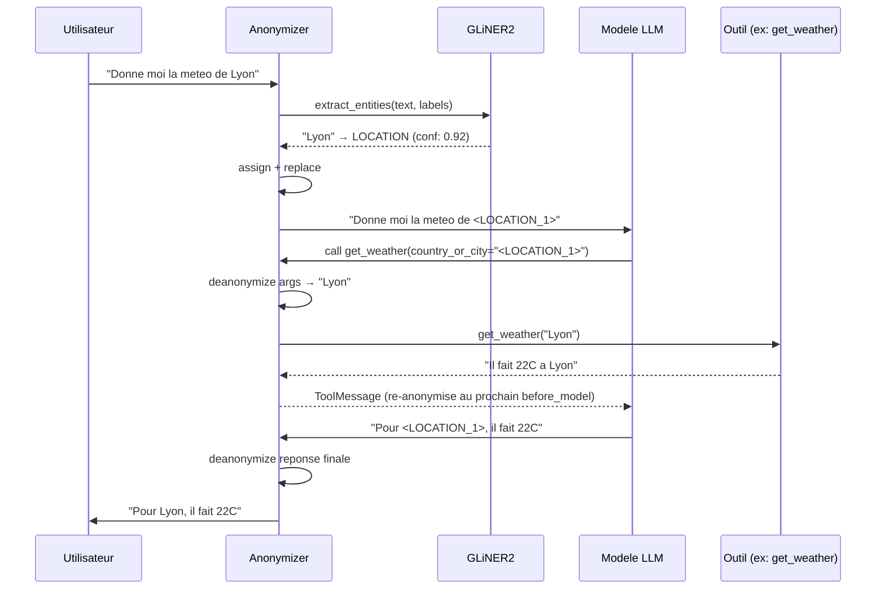
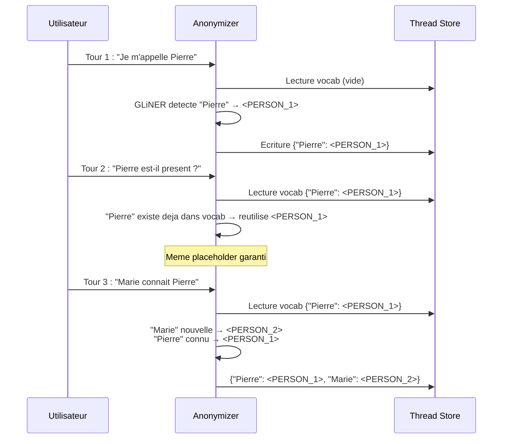

# Architecture

Cette page explique en detail le pipeline d'anonymisation de Maskara : chaque etape, pourquoi elle existe, et pourquoi elle est concue de cette maniere plutot qu'une autre.

---

## Vue d'ensemble

Le pipeline d'anonymisation tient en trois etapes :

```
detect  →  assign  →  replace
```

1. **Detect** : GLiNER2 analyse le texte et retourne les entites nommees detectees.
2. **Assign** : chaque entite recoit un placeholder unique (`<TYPE_N>`), en reutilisant ceux deja connus pour ce thread.
3. **Replace** : chaque valeur originale est remplacee dans le texte par son placeholder, en traitant les plus longs d'abord.

La desanonymisation est l'operation inverse : on inverse le vocabulaire et on fait le meme remplacement.

---

## Etape 1 Detection (`_detect`)

```python
raw = self.extractor.extract_entities(text, self.entity_types,
    include_spans=True, include_confidence=True)
```

GLiNER2 est un modele NER zero-shot : il detecte des entites sans avoir besoin d'un modele entraine specifiquement pour chaque type. On lui passe une liste de labels (`"person"`, `"location"`, `"company"`, `"product"`) et il retourne les entites trouvees avec un score de confiance.

**Filtrage par confiance** : seules les entites dont le score est >= `min_confidence` (defaut: 0.5) sont conservees. Les detections en dessous sont ignorees pour eviter les faux positifs.

**Strip du whitespace** : les surfaces detectees sont strippees (`entity["text"].strip()`) pour normaliser les cas ou GLiNER inclut un espace en debut/fin de span. Cela evite que `"Lyon "` et `"Lyon"` soient traites comme deux entites differentes.

**Ce que cette etape retourne** : une liste de tuples `(texte_stripped, entity_type)` pas d'objet complexe, pas de coordonnees. On n'a besoin que de savoir *quoi* a ete detecte et *quel type* c'est.

### Pourquoi pas de spans ?

L'ancienne version conservait les offsets de caracteres (`start`, `end`) de chaque detection pour faire un remplacement position-par-position. Mais `str.replace()` n'a pas besoin de positions il remplace *toutes* les occurrences d'une chaine par une autre. Cela rend les spans inutiles pour le remplacement.

De plus, GLiNER ne detecte typiquement que la **premiere occurrence** d'une entite. L'ancienne version compensait avec une etape supplementaire (`expand_placeholders`) qui re-scannait le texte entier. `str.replace()` fait exactement ca nativement.

---

## Etape 2 Assignation (`_assign`)

```python
def _assign(self, detections, vocab):
    # Construit un set d'indices deja utilises par type
    # Pour chaque entite detectee pas encore dans vocab :
    #   - Trouve le prochain index libre pour ce type
    #   - Assigne "<TYPE_N>" dans vocab
```

Cette etape assigne un placeholder a chaque texte d'entite qui n'en a pas encore.

**Regles :**

- Meme texte → meme placeholder (garanti par le lookup `if text in vocab`)
- Textes differents du meme type → indices distincts (`<PERSON_1>`, `<PERSON_2>`)
- Les placeholders deja assignes dans les tours precedents sont reutilises (via le `vocab` charge depuis `_thread_store`)

**Comment le prochain index est trouve** : on parse les placeholders existants pour extraire les indices deja utilises par type, puis on part de 1 et on incremente jusqu'a trouver un index libre. C'est un `while idx in indices: idx += 1`.

### Pourquoi pas un simple compteur ?

Un compteur par type (`self._counters["PERSON"] += 1`) serait plus simple, mais il ne survit pas a la serialisation. Le vocabulaire est un `dict[str, str]` pur (texte → placeholder) qu'on peut facilement persister, logger, ou inspecter. En re-parsant les indices depuis les placeholders existants, on reconstruit l'etat sans stocker de metadata supplementaire.

### Pourquoi la mutation in-place ?

`_assign` modifie `vocab` directement au lieu de retourner un nouveau dictionnaire. C'est un choix delibere : `anonymize()` fait une copie du vocab du thread store avant d'appeler `_assign`, donc la mutation est safe. Et ca evite une allocation supplementaire.

---

## Etape 3 Remplacement (`_replace`)

```python
@staticmethod
def _replace(text, mapping):
    for key in sorted(mapping, key=len, reverse=True):
        text = text.replace(key, mapping[key])
    return text
```

Chaque cle du mapping est remplacee dans le texte par sa valeur. **Le tri par longueur decroissante est critique.**

### Pourquoi longest-first ?

Imaginons un texte contenant `"Apple Inc."` et `"Apple"` :

```
Sans tri :  "Apple" est remplace en premier
  "Apple Inc. CEO" → "<COMPANY_1> Inc. CEO"
  "Inc." n'est plus rattachable a "Apple Inc."

Avec longest-first : "Apple Inc." est remplace en premier
  "Apple Inc. CEO" → "<COMPANY_1> CEO"
  Correct : l'entite la plus specifique gagne.
```

Le tri garantit que les entites longues (plus specifiques) sont remplacees avant les courtes (plus generiques). Si `"Apple"` apparait aussi seul ailleurs dans le texte, il sera remplace par son propre placeholder dans un second passage.

### Pourquoi `str.replace` plutot que des remplacements par position ?

L'ancienne version utilisait des offsets de caracteres : elle remplacait chaque span individuellement, de droite a gauche, pour eviter de decaler les positions. C'etait necessaire parce que les detections avaient des coordonnees precises.

`str.replace` est plus simple et plus robuste :

1. **Toutes les occurrences** : `str.replace` remplace *toutes* les occurrences d'une chaine, pas seulement celles detectees par GLiNER. Ca compense nativement la detection partielle.
2. **Pas de gestion d'offsets** : pas besoin de trier, pas de risque de decalage, pas de code de reconciliation.
3. **Pas de chevauchements a resoudre** : le tri longest-first gere les imbrications naturellement.

Le compromis : `str.replace` fait du matching exact. Si le texte contient `"paris"` (minuscule) et que GLiNER a detecte `"Paris"` (majuscule), le remplacement ne matchera pas la variante. C'est un cas que le fuzzy matching futur adressera.

### Interaction entre les cles du mapping

Un point subtil : si le vocab contient `{"Lyon": "<LOCATION_1>"}` et qu'on remplace dans le texte `"Lyon est en Rhone-Alpes"`, le resultat est `"<LOCATION_1> est en Rhone-Alpes"`. Mais si le texte contenait le *placeholder* d'une autre entite (par exemple apres un tour precedent), `str.replace` ne le toucherait pas puisque les placeholders (`<TYPE_N>`) ne correspondent a aucune cle du mapping (qui sont des textes en langage naturel).

---

## Desanonymisation

```python
def deanonymize(self, text, vocab):
    reverse = {ph: original for original, ph in vocab.items()}
    return self._replace(text, reverse)
```

L'operation inverse : on inverse le mapping (`placeholder → texte original`) et on applique le meme `_replace`. Le tri longest-first est aussi important ici pour eviter qu'un placeholder court soit remplace avant un long (par exemple `<PERSON_1>` avant `<PERSON_10>`).

---

## Memoire par thread

```python
# Dans anonymize() :
tid = thread_id or uuid4().hex
vocab = dict(self._thread_store.get(tid, {}))   # copie
# ... detect, assign ...
self._thread_store[tid] = vocab                   # sauvegarde
```

Le `_thread_store` est un dictionnaire `{thread_id: vocab}` qui persiste en memoire les mappings de chaque conversation.

### Pourquoi c'est necessaire

Sans memoire inter-tours, la meme entite pourrait recevoir des placeholders differents :

```
Tour 1 : "Pierre" → <PERSON_1>         (seule entite detectee)
Tour 2 : "Marie et Pierre" → "Marie" prend <PERSON_1>, "Pierre" prend <PERSON_2>
```

Le LLM verrait `<PERSON_1>` designer "Pierre" dans un message et "Marie" dans un autre incoherent.

Avec le thread store, le tour 2 charge le vocab `{"Pierre": "<PERSON_1>"}`, donc "Pierre" garde `<PERSON_1>` et "Marie" recoit `<PERSON_2>`.

### Cycle de vie du vocab

1. **Debut de `anonymize()`** : le vocab est **copie** depuis le thread store (pas une reference les modifications ne fuient pas si l'appel echoue).
2. **`_assign()`** : les nouvelles entites sont ajoutees au vocab.
3. **Fin de `anonymize()`** : le vocab mis a jour est ecrit dans le thread store.

Si `thread_id` n'est pas fourni, un UUID est genere. Le vocab est alors isole et ne sera pas reutilise utile pour les anonymisations ponctuelles.

---

## Flux complet Anonymisation

```
Texte : "Pierre habite a Lyon. Pierre sera a Lyon demain."

  _detect()
    GLiNER2 detecte : [("Pierre", "person"), ("Lyon", "location")]
    (GLiNER ne detecte souvent que la premiere occurrence)

  _assign(detections, vocab={})
    "Pierre" → <PERSON_1>    (index 1, premier du type PERSON)
    "Lyon"   → <LOCATION_1>  (index 1, premier du type LOCATION)
    vocab = {"Pierre": "<PERSON_1>", "Lyon": "<LOCATION_1>"}

  _replace(text, vocab)
    tri par longueur : "Pierre" (6) >= "Lyon" (4) → "Pierre" d'abord
    str.replace("Pierre", "<PERSON_1>")
      → "<PERSON_1> habite a Lyon. <PERSON_1> sera a Lyon demain."
         (les DEUX "Pierre" sont remplaces)
    str.replace("Lyon", "<LOCATION_1>")
      → "<PERSON_1> habite a <LOCATION_1>. <PERSON_1> sera a <LOCATION_1> demain."
         (les DEUX "Lyon" sont remplaces)

Resultat : "<PERSON_1> habite a <LOCATION_1>. <PERSON_1> sera a <LOCATION_1> demain."
```

A noter : GLiNER n'avait detecte qu'une seule occurrence de chaque entite. `str.replace` a couvert les deux occurrences sans etape supplementaire.

---

## Flux complet Desanonymisation

```
Texte anonymise : "<PERSON_1> habite a <LOCATION_1>."
Vocab : {"Pierre": "<PERSON_1>", "Lyon": "<LOCATION_1>"}

  reverse = {"<PERSON_1>": "Pierre", "<LOCATION_1>": "Lyon"}

  _replace(text, reverse)
    tri par longueur : "<LOCATION_1>" (14) > "<PERSON_1>" (11)
    str.replace("<LOCATION_1>", "Lyon")
      → "<PERSON_1> habite a Lyon."
    str.replace("<PERSON_1>", "Pierre")
      → "Pierre habite a Lyon."

Resultat : "Pierre habite a Lyon."
```

---

## Flux conversation avec outils



---

## Coherence multi-tours



---

## Format des jetons

```
<TYPE_N>
```

- `TYPE` : label de l'entite en majuscules `PERSON`, `LOCATION`, `COMPANY`, `PRODUCT`
- `N` : index 1-based par type, stable au sein d'un thread

Exemples :

```
"Tim Cook"   → <PERSON_1>
"Steve Jobs" → <PERSON_2>
"Apple Inc." → <COMPANY_1>
"Cupertino"  → <LOCATION_1>
```

### Pourquoi `<TYPE_N>` et pas un hash ?

Le `middleware.py` utilise un format different (`<TYPE:hash>`). Les deux ont des avantages :

| | `<TYPE_N>` | `<TYPE:hash>` |
|---|---|---|
| Lisibilite | `<PERSON_1>` est facile a lire dans les logs | `<PERSON:a1b2c3d4>` est opaque |
| Determinisme | Depend de l'ordre d'apparition + thread store | Deterministe par valeur (meme hash partout) |
| Collisions | Impossible (index incremental) | Possible mais improbable (8 hex = 4 milliards) |
| Debugging | Facile de suivre "personne 1 = qui ?" | Necessite le mapping inverse |

L'`Anonymizer` utilise `<TYPE_N>` car c'est plus lisible pour le prototypage et le debug. Le middleware utilise le hash car il n'a pas besoin d'un thread store pour garantir le determinisme.

---

## Limites connues

### Matching exact uniquement

`str.replace` fait du matching exact, sensible a la casse. Si GLiNER detecte `"Paris"` mais que le texte contient aussi `"paris"` (minuscule), la variante ne sera pas remplacee.

C'est un compromis accepte : le matching exact est simple, rapide, et n'introduit pas de faux positifs. Le fuzzy matching est prevu comme evolution future il suffira de normaliser les cles du vocab (ex: lowercase) lors du lookup dans `_assign()`.

### Contenu non-string

L'anonymizer ne supporte que les messages dont le `content` est une chaine. Les messages multimodaux (images, listes de blocs) ne sont pas anonymises.

### Memoire in-memory

Le `_thread_store` vit en memoire de l'instance Python. Un redemarrage du serveur perd tous les mappings. Pour la persistance, le `PIIAnonymizationMiddleware` stocke les mappings dans le state LangGraph, qui est checkpointe en base.
