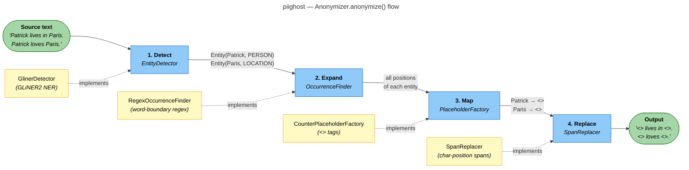
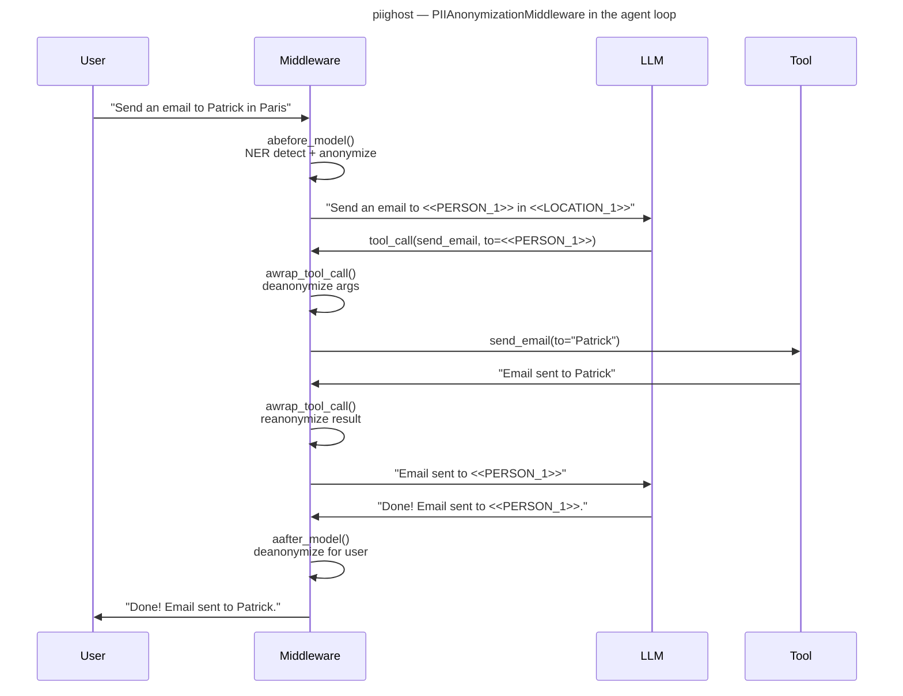

# Architecture

PIIGhost is organized in distinct layers: a **stateless anonymizer** at the core, wrapped in a **session-aware pipeline**, adapted to LangChain via a **middleware**.

---

## Overview

```
┌─────────────────────────────────────────────────────────┐
│                  PIIAnonymizationMiddleware              │  ← LangChain layer
│  abefore_model · aafter_model · awrap_tool_call         │
└────────────────────────┬────────────────────────────────┘
                         │
┌────────────────────────▼────────────────────────────────┐
│                   AnonymizationPipeline                  │  ← Cache & session
│  PlaceholderStore · bidirectional in-memory registry    │
└────────────────────────┬────────────────────────────────┘
                         │
┌────────────────────────▼────────────────────────────────┐
│                      Anonymizer                          │  ← 4-stage pipeline
│  Detect → Expand → Map → Replace                        │
└─────────────────────────────────────────────────────────┘
```

---

## 4-stage pipeline

The core of PIIGhost is the `Anonymizer` class, which orchestrates 4 stages — each implemented by a swappable protocol.



### Stage 1 — Detect

`EntityDetector` runs NER detection on the source text and returns a list of `Entity` objects (start position, end position, label, confidence score).

The provided implementation, `GlinerDetector`, wraps the **GLiNER2** model (`fastino/gliner2-multi-v1`).

### Stage 2 — Expand

`OccurrenceFinder` locates **all** occurrences of each unique entity in the source text — not just the one the NER model found.

`RegexOccurrenceFinder` uses a `\bENTITY\b` pattern (case-insensitive) to avoid partial matches (`"APatrick"` is not matched as `"Patrick"`).

### Stage 3 — Map

`PlaceholderFactory` assigns a stable tag to each unique `(text, label)` pair.

`CounterPlaceholderFactory` generates sequential tags: `<<PERSON_1>>`, `<<PERSON_2>>`, `<<LOCATION_1>>`, etc. The same original always returns the same placeholder within a single pass.

### Stage 4 — Replace

`SpanReplacer` applies substitutions by character position and computes **reverse spans** for deanonymization. Two modes:

- **`apply(text, spans)`** — replaces left-to-right, tracks offsets, computes reverse spans
- **`restore(result)`** — re-applies reverse spans to restore the original

---

## LangChain middleware flow

`PIIAnonymizationMiddleware` intercepts the agent loop at 3 key points.



### `abefore_model`

Before each LLM call:

- `HumanMessage` → **full NER** via `pipeline.anonymize()` (detects new entities)
- `AIMessage` / `ToolMessage` → **string replacement** via `pipeline.reanonymize_text()` (covers values deanonymized on the previous turn)

### `aafter_model`

After each LLM response: replaces all placeholder tags with original values across all messages, so the user always sees readable text.

### `awrap_tool_call`

Wraps each tool call:

1. Deanonymizes `str` arguments before execution → the tool receives real values
2. Executes the tool
3. Reanonymizes the tool response → the LLM never sees personal data

---

## Session layer — `AnonymizationPipeline`

`AnonymizationPipeline` adds two mechanisms on top of the stateless `Anonymizer`:

| Mechanism | Description |
|-----------|-------------|
| **`PlaceholderStore`** (async) | Persistent cross-session cache, keyed by SHA-256 of the source text |
| **`_results` registry** (sync) | In-memory list for fast synchronous deanonymization/reanonymization |

```python
# Cache hit: same text → result returned without NER call
result1 = await pipeline.anonymize("Patrick lives in Paris.")
result2 = await pipeline.anonymize("Patrick lives in Paris.")  # from cache

# Synchronous deanonymization on any derived string
pipeline.deanonymize_text("Result for <<PERSON_1>>")
# → "Result for Patrick"
```

---

## Data models

All models are **frozen dataclasses** (immutable, thread-safe):

| Model | Key fields |
|-------|------------|
| `Entity` | `text`, `label`, `start`, `end`, `score` |
| `Placeholder` | `original`, `label`, `replacement` |
| `AnonymizationResult` | `original_text`, `anonymized_text`, `placeholders`, `reverse_spans` |
| `Span` | `start`, `end`, `replacement` |
| `ReplacementResult` | `text`, `reverse_spans` |

---

## Dependency injection

Every stage uses a **protocol** (Python structural subtyping) as its injection point. No concrete class is imported directly by `Anonymizer` — only the protocols:

```python
Anonymizer(
    detector=GlinerDetector(...),               # EntityDetector
    occurrence_finder=RegexOccurrenceFinder(),  # OccurrenceFinder
    placeholder_factory=CounterPlaceholderFactory(),  # PlaceholderFactory
    replacer=SpanReplacer(),                    # SpanReplacer
)
```

To replace a component, simply provide an object that implements the corresponding protocol. See [Extending PIIGhost](extending.md).
