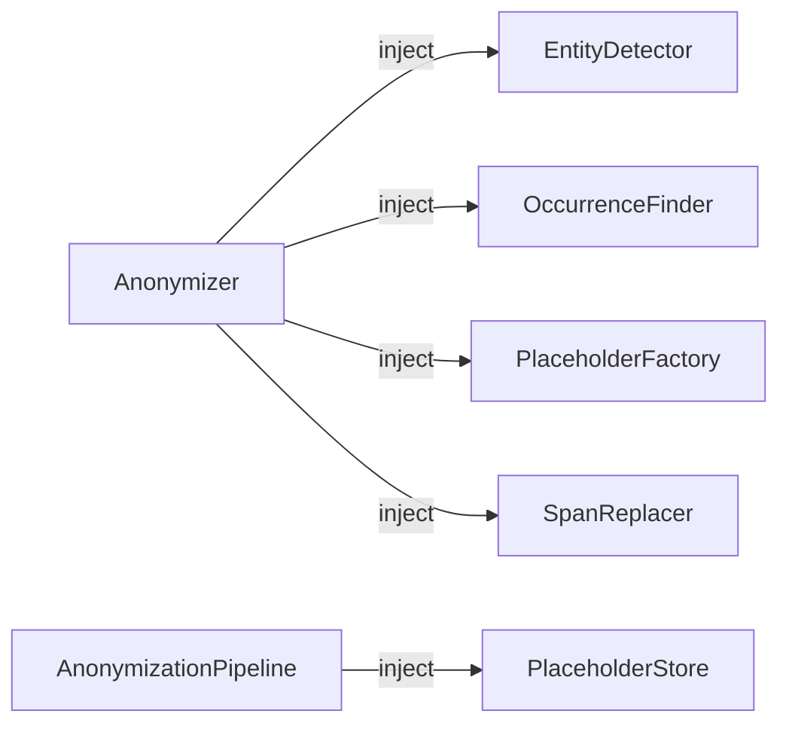

# Extending Maskara

Maskara is built around **protocols** (Python structural subtyping). Every pipeline stage is an injection point where you can plug in your own implementation without touching the rest of the code.



No base class to inherit from. Simply implement the required method — Python checks compatibility at call time.

---

## Custom `EntityDetector`

**When to use**: replace GLiNER2 with spaCy, a remote API call, an allowlist, etc.

### Protocol

```python
class EntityDetector(Protocol):
    def detect(self, text: str, labels: Sequence[str]) -> list[Entity]:
        ...
```

### Example — spaCy detector

```python
from typing import Sequence
import spacy
from maskara.anonymizer.models import Entity

class SpacyDetector:
    """NER detector backed by spaCy."""

    def __init__(self, model_name: str = "en_core_web_sm"):
        self._nlp = spacy.load(model_name)

    def detect(self, text: str, labels: Sequence[str]) -> list[Entity]:
        doc = self._nlp(text)
        return [
            Entity(
                text=ent.text,
                label=ent.label_,
                start=ent.start_char,
                end=ent.end_char,
                score=1.0,
            )
            for ent in doc.ents
            if ent.label_ in labels
        ]
```

### Example — allowlist detector

```python
from typing import Sequence
from maskara.anonymizer.models import Entity

class AllowlistDetector:
    """Detects entities from a fixed list (useful for tests or structured data)."""

    def __init__(self, allowlist: dict[str, str]):
        # {"Patrick Dupont": "PERSON", "Paris": "LOCATION"}
        self._allowlist = allowlist

    def detect(self, text: str, labels: Sequence[str]) -> list[Entity]:
        entities = []
        for fragment, label in self._allowlist.items():
            if label not in labels:
                continue
            start = text.find(fragment)
            if start != -1:
                entities.append(Entity(
                    text=fragment,
                    label=label,
                    start=start,
                    end=start + len(fragment),
                    score=1.0,
                ))
        return entities
```

### Usage

```python
from maskara.anonymizer import Anonymizer

anonymizer = Anonymizer(detector=SpacyDetector("en_core_web_sm"))
# or
anonymizer = Anonymizer(detector=AllowlistDetector({"Patrick": "PERSON"}))
```

---

## Custom `OccurrenceFinder`

**When to use**: fuzzy matching (typos, phonetic variants), exact case-sensitive search, etc.

### Protocol

```python
class OccurrenceFinder(Protocol):
    def find_all(self, text: str, fragment: str) -> list[tuple[int, int]]:
        ...
```

### Example — exact match (case-sensitive)

```python
class ExactOccurrenceFinder:
    """Finds all exact occurrences (case-sensitive)."""

    def find_all(self, text: str, fragment: str) -> list[tuple[int, int]]:
        results = []
        start = 0
        while True:
            idx = text.find(fragment, start)
            if idx == -1:
                break
            results.append((idx, idx + len(fragment)))
            start = idx + 1
        return results
```

### Example — fuzzy matching (Levenshtein)

```python
from rapidfuzz import fuzz

class FuzzyOccurrenceFinder:
    """Detects entities even with typos (score > threshold)."""

    def __init__(self, threshold: int = 80):
        self._threshold = threshold

    def find_all(self, text: str, fragment: str) -> list[tuple[int, int]]:
        results = []
        words = text.split()
        offset = 0
        for word in words:
            score = fuzz.ratio(word, fragment)
            if score >= self._threshold:
                start = text.find(word, offset)
                results.append((start, start + len(word)))
            offset += len(word) + 1
        return results
```

### Usage

```python
anonymizer = Anonymizer(
    detector=my_detector,
    occurrence_finder=ExactOccurrenceFinder(),
)
```

---

## Custom `PlaceholderFactory`

**When to use**: UUID tags for full anonymity, custom format, integration with an external token system.

### Protocol

```python
class PlaceholderFactory(Protocol):
    def get_or_create(self, original: str, label: str) -> Placeholder:
        ...

    def reset(self) -> None:
        ...
```

### Example — UUID tags

```python
import uuid
from maskara.anonymizer.models import Placeholder

class UUIDPlaceholderFactory:
    """Generates opaque UUID tags, e.g. <<a3f2-1b4c>>."""

    def __init__(self):
        self._cache: dict[tuple[str, str], Placeholder] = {}

    def get_or_create(self, original: str, label: str) -> Placeholder:
        key = (original, label)
        if key not in self._cache:
            token = str(uuid.uuid4())[:8]
            self._cache[key] = Placeholder(
                original=original,
                label=label,
                replacement=f"<<{token}>>",
            )
        return self._cache[key]

    def reset(self) -> None:
        self._cache.clear()
```

### Example — custom format

```python
from maskara.anonymizer.models import Placeholder

class BracketPlaceholderFactory:
    """Generates tags in the format [PERSON:1], [LOCATION:2], etc."""

    def __init__(self):
        self._counters: dict[str, int] = {}
        self._cache: dict[tuple[str, str], Placeholder] = {}

    def get_or_create(self, original: str, label: str) -> Placeholder:
        key = (original, label)
        if key not in self._cache:
            self._counters[label] = self._counters.get(label, 0) + 1
            replacement = f"[{label}:{self._counters[label]}]"
            self._cache[key] = Placeholder(original=original, label=label, replacement=replacement)
        return self._cache[key]

    def reset(self) -> None:
        self._counters.clear()
        self._cache.clear()
```

### Usage

```python
anonymizer = Anonymizer(
    detector=my_detector,
    placeholder_factory=UUIDPlaceholderFactory(),
)
```

---

## Custom `PlaceholderStore`

**When to use**: cross-session persistence via Redis, PostgreSQL, or any other backend.

### Protocol

```python
class PlaceholderStore(Protocol):
    async def get(self, key: str) -> AnonymizationResult | None:
        ...

    async def set(self, key: str, result: AnonymizationResult) -> None:
        ...
```

The key is always a **SHA-256 hash** of the source text.

### Example — Redis backend

```python
import pickle
from maskara.anonymizer.models import AnonymizationResult

class RedisPlaceholderStore:
    """Redis store for cross-process and cross-session persistence."""

    def __init__(self, client, prefix: str = "maskara", ttl: int = 86400):
        self._client = client  # async Redis client (e.g. redis.asyncio)
        self._prefix = prefix
        self._ttl = ttl

    async def get(self, key: str) -> AnonymizationResult | None:
        data = await self._client.get(f"{self._prefix}:{key}")
        return pickle.loads(data) if data else None

    async def set(self, key: str, result: AnonymizationResult) -> None:
        data = pickle.dumps(result)
        await self._client.setex(f"{self._prefix}:{key}", self._ttl, data)
```

### Example — PostgreSQL backend (asyncpg)

```python
import pickle
from maskara.anonymizer.models import AnonymizationResult

class PostgresPlaceholderStore:
    """PostgreSQL store for multi-instance deployments."""

    def __init__(self, pool):
        self._pool = pool  # asyncpg pool

    async def get(self, key: str) -> AnonymizationResult | None:
        async with self._pool.acquire() as conn:
            row = await conn.fetchrow(
                "SELECT data FROM maskara_cache WHERE key = $1", key
            )
            return pickle.loads(row["data"]) if row else None

    async def set(self, key: str, result: AnonymizationResult) -> None:
        async with self._pool.acquire() as conn:
            await conn.execute(
                """
                INSERT INTO maskara_cache (key, data) VALUES ($1, $2)
                ON CONFLICT (key) DO UPDATE SET data = EXCLUDED.data
                """,
                key,
                pickle.dumps(result),
            )
```

### Usage

```python
from maskara.pipeline import AnonymizationPipeline

pipeline = AnonymizationPipeline(
    anonymizer=anonymizer,
    labels=["PERSON", "LOCATION"],
    store=RedisPlaceholderStore(redis_client),
)
```

---

## Full composition

All components are independent and can be freely combined:

```python
from maskara.anonymizer import Anonymizer
from maskara.pipeline import AnonymizationPipeline
from maskara.middleware import PIIAnonymizationMiddleware

anonymizer = Anonymizer(
    detector=SpacyDetector("en_core_web_sm"),       # Your detector
    occurrence_finder=FuzzyOccurrenceFinder(80),     # Fuzzy matching
    placeholder_factory=UUIDPlaceholderFactory(),    # Opaque UUID tags
)

pipeline = AnonymizationPipeline(
    anonymizer=anonymizer,
    labels=["PERSON", "LOCATION", "ORGANIZATION"],
    store=RedisPlaceholderStore(redis_client),        # Redis persistence
)

middleware = PIIAnonymizationMiddleware(pipeline=pipeline)
```

---

## Testing your components

Protocols make unit testing straightforward. Here is how to test a custom detector:

```python
import pytest
from maskara.anonymizer import Anonymizer
from maskara.anonymizer.models import Entity

class FakeDetector:
    def __init__(self, entities):
        self.entities = entities

    def detect(self, text, labels):
        return self.entities

def test_my_anonymizer():
    entities = [Entity(text="Alice", label="PERSON", start=0, end=5, score=1.0)]
    anonymizer = Anonymizer(detector=FakeDetector(entities))

    result = anonymizer.anonymize("Alice lives in Lyon.", labels=["PERSON", "LOCATION"])
    assert "<<PERSON_1>>" in result.anonymized_text
    assert "Alice" not in result.anonymized_text
```

!!! tip "FakeDetector in CI"
    Always use `FakeDetector` (or equivalent) in CI to avoid loading the GLiNER2 model (~500 MB) during automated tests.
