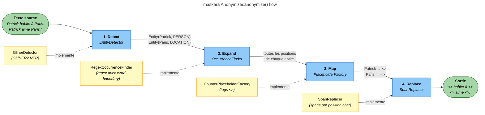
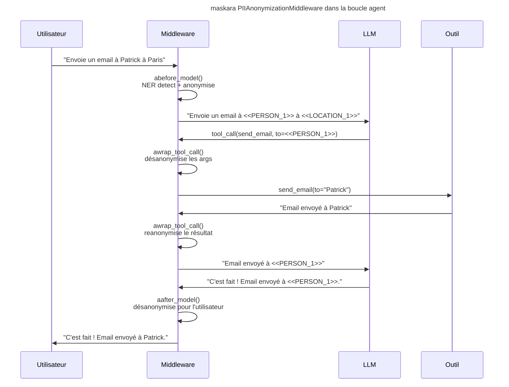

# Architecture

Maskara est organisé en couches distinctes : un **anonymiseur stateless** au cœur, encapsulé dans un **pipeline avec état de session**, adapté au monde LangChain via un **middleware**.

---

## Vue d'ensemble

```
┌─────────────────────────────────────────────────────────┐
│                  PIIAnonymizationMiddleware              │  ← Couche LangChain
│  abefore_model · aafter_model · awrap_tool_call         │
└────────────────────────┬────────────────────────────────┘
                         │
┌────────────────────────▼────────────────────────────────┐
│                   AnonymizationPipeline                  │  ← Cache & session
│  PlaceholderStore · registre en mémoire bidirectionnel  │
└────────────────────────┬────────────────────────────────┘
                         │
┌────────────────────────▼────────────────────────────────┐
│                      Anonymizer                          │  ← Pipeline 4 étapes
│  Detect → Expand → Map → Replace                        │
└─────────────────────────────────────────────────────────┘
```

---

## Pipeline 4 étapes

Le cœur de Maskara est la classe `Anonymizer` qui orchestre 4 étapes, chacune implémentée par un protocole swappable.



### Étape 1 Detect

`EntityDetector` exécute la détection NER sur le texte source et retourne une liste d'objets `Entity` (position de début, de fin, label, score de confiance).

L'implémentation fournie, `GlinerDetector`, enveloppe le modèle **GLiNER2** (`fastino/gliner2-multi-v1`).

### Étape 2 Expand

`OccurrenceFinder` localise **toutes** les occurrences de chaque entité unique dans le texte source pas seulement celle que le modèle NER a trouvée.

`RegexOccurrenceFinder` utilise un pattern `\bENTITY\b` (insensible à la casse) pour éviter les correspondances partielles (`"APatrick"` n'est pas reconnu comme `"Patrick"`).

### Étape 3 Map

`PlaceholderFactory` assigne un tag stable à chaque paire `(texte, label)` unique.

`CounterPlaceholderFactory` génère des tags séquentiels : `<<PERSON_1>>`, `<<PERSON_2>>`, `<<LOCATION_1>>`, etc. Le même original retourne toujours le même placeholder dans un même passage.

### Étape 4 Replace

`SpanReplacer` applique les substitutions par position de caractères et calcule les **spans inverses** pour la désanonymisation. Deux modes :

- **`apply(text, spans)`** remplace de gauche à droite, calcule les offsets inverses
- **`restore(result)`** ré-applique les spans inverses pour restaurer l'original

---

## Flux middleware LangChain

Le `PIIAnonymizationMiddleware` intercepte le cycle de l'agent à 3 points clés.



### `abefore_model`

Avant chaque appel LLM :

- `HumanMessage` → **NER complet** via `pipeline.anonymize()` (détecte de nouvelles entités)
- `AIMessage` / `ToolMessage` → **remplacement de chaîne** via `pipeline.reanonymize_text()` (couvre les valeurs qui auraient été désanonymisées lors du tour précédent)

### `aafter_model`

Après chaque réponse LLM : remplace tous les tags placeholder par les valeurs originales dans tous les messages, pour que l'utilisateur voie du texte lisible.

### `awrap_tool_call`

Enveloppe chaque appel d'outil :

1. Désanonymise les arguments `str` avant l'exécution → l'outil reçoit les vraies valeurs
2. Exécute l'outil
3. Reanonymise la réponse de l'outil → le LLM ne voit pas de vraies données

---

## Couche session `AnonymizationPipeline`

`AnonymizationPipeline` ajoute deux mécanismes au-dessus de l'`Anonymizer` stateless :

| Mécanisme | Description |
|-----------|-------------|
| **`PlaceholderStore`** (async) | Cache persistant inter-sessions, clé = SHA-256 du texte source |
| **Registre `_results`** (sync) | Liste en mémoire pour la désanonymisation/reanonymisation synchrone rapide |

```python
# Cache hit : même texte → résultat récupéré sans appel NER
result1 = await pipeline.anonymize("Patrick habite à Paris.")
result2 = await pipeline.anonymize("Patrick habite à Paris.")  # depuis le cache

# Désanonymisation synchrone sur n'importe quelle chaîne dérivée
pipeline.deanonymize_text("Résultat pour <<PERSON_1>>")
# → "Résultat pour Patrick"
```

---

## Modèles de données

Tous les modèles sont des **dataclasses gelées** (immutables, thread-safe) :

| Modèle | Champs clés |
|--------|-------------|
| `Entity` | `text`, `label`, `start`, `end`, `score` |
| `Placeholder` | `original`, `label`, `replacement` |
| `AnonymizationResult` | `original_text`, `anonymized_text`, `placeholders`, `reverse_spans` |
| `Span` | `start`, `end`, `replacement` |
| `ReplacementResult` | `text`, `reverse_spans` |

---

## Injection de dépendances

Chaque étape utilise un **protocole** (typage structurel Python) comme point d'injection. Aucune classe concrète n'est importée directement par l'`Anonymizer` uniquement les protocoles :

```python
Anonymizer(
    detector=GlinerDetector(...),            # EntityDetector
    occurrence_finder=RegexOccurrenceFinder(),  # OccurrenceFinder
    placeholder_factory=CounterPlaceholderFactory(),  # PlaceholderFactory
    replacer=SpanReplacer(),                 # SpanReplacer
)
```

Pour remplacer un composant, il suffit de fournir un objet implémentant le protocole correspondant. Voir [Étendre Maskara](../extending.md).
