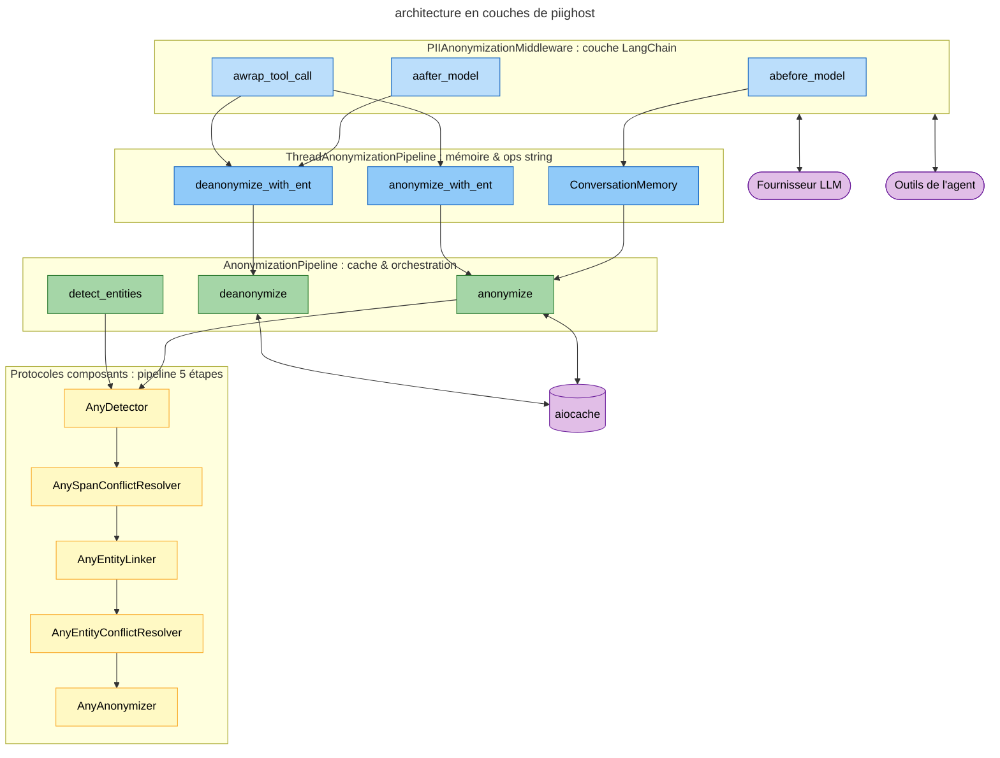
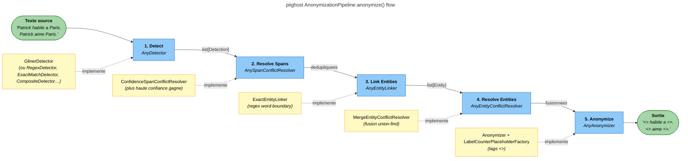
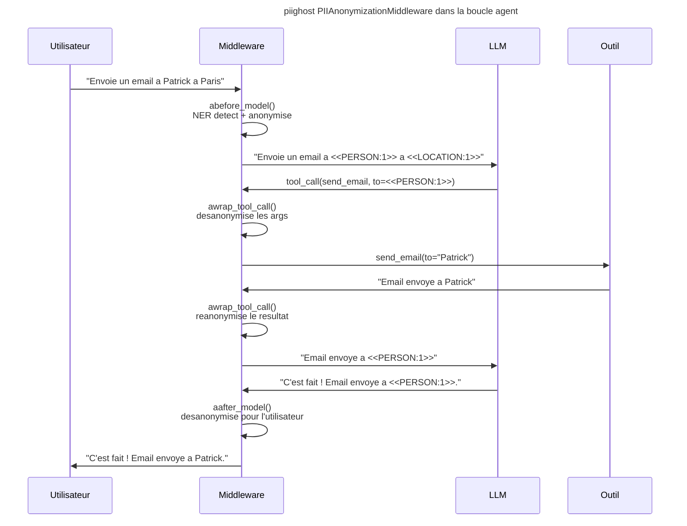
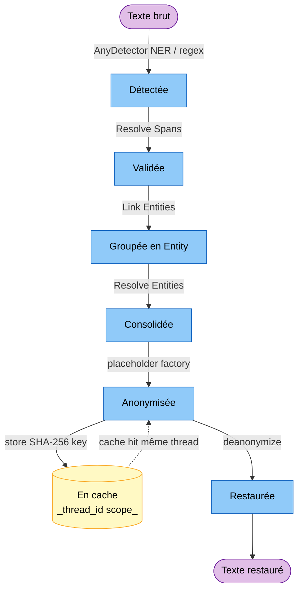

# Architecture

PIIGhost est organise en couches distinctes : un **anonymiseur stateless** au coeur, encapsule dans un **pipeline** avec cache et resolution d'entites, etendu par un **pipeline conversationnel** avec memoire, adapte au monde LangChain via un **middleware**.

---

## Vue d'ensemble



*Architecture en couches : du protocole au middleware LangChain.*
{ .figure-caption }

---

## Pipeline 5 etapes

!!! tip "Tout est remplaçable"
    Chaque étape se trouve derrière un protocole. Voir [Étendre PIIGhost](extending.md) pour brancher votre propre détecteur, linker, résolveur ou factory.

Le coeur de PIIGhost est `AnonymizationPipeline` qui orchestre 5 etapes, chacune implementee par un protocole swappable.



### Etape 1 Detect

`AnyDetector` execute la detection async sur le texte source et retourne une liste d'objets `Detection` (text, label, position, confidence).

Les implementations fournies incluent `ExactMatchDetector` (regex word-boundary), `RegexDetector` (patterns), `Gliner2Detector` (NER), et `CompositeDetector` (chaine plusieurs detecteurs).

**Exemple :**

```text
Texte : "Patrick habite a Paris."

Détections :
  - PERSON   "Patrick"  [0:7]   confidence=0.95
  - LOCATION "Paris"    [17:22] confidence=0.92
```

A ce stade, on a une liste brute de detections. Pas encore d'anonymisation ni de gestion de doublons : juste « voici ce qui ressemble a des PII et ou elles sont ».

### Etape 2 Resolve Spans

**Le probleme.** Quand on chaine plusieurs detecteurs sur le meme texte, ils peuvent revendiquer le meme morceau avec des labels differents. Sans arbitrage, le remplacement final tape deux fois sur la meme position et casse le texte.

`AnySpanConflictResolver` gere les detections qui se chevauchent (totalement ou partiellement) en gardant celle avec la plus haute confiance.

**Exemple :**

```text
Texte : "Patrick travaille chez Orange depuis 2015."

Détections en entrée :
  - PERSON "Patrick" [0:7] confidence=0.95   (NER A)
  - ORG    "Patrick" [0:7] confidence=0.60   (NER B, confond avec un nom d'entreprise)

Après ConfidenceSpanConflictResolver :
  - PERSON "Patrick" [0:7] confidence=0.95
```

### Etape 3 Link Entities

**Le probleme.** Le NER rate des occurrences. Il trouve `Patrick Dupont` dans la phrase 1, mais rate `Patrick` tout seul dans la phrase 3. Si on s'arrete a la detection brute, `Patrick` reste en clair dans le texte anonymise.

`AnyEntityLinker` etend et groupe les detections en objets `Entity`. `ExactEntityLinker` cherche toutes les occurrences de chaque texte detecte par recherche word-boundary, puis les groupe par texte normalise.

**Exemple :**

```text
Texte : "Patrick Dupont habite à Paris. Patrick adore Paris."

Détections brutes du NER :
  - PERSON   "Patrick Dupont"  (phrase 1)
  - LOCATION "Paris"            (phrase 1)
  # "Patrick" et "Paris" de la phrase 2 ont été ratés par le NER

Après ExactEntityLinker :
  - Entity(label=PERSON,   detections=["Patrick Dupont", "Patrick"])
  - Entity(label=LOCATION, detections=["Paris", "Paris"])
```

Le matching est strict sur la chaine. Pour rattraper les variantes de casse ou les fautes (`patrick`, `Patriick`), il faut un linker fuzzy custom (voir [Etendre PIIGhost](extending.md)).

### Etape 4 Resolve Entities

**Le probleme.** Apres le linker, deux entites distinctes peuvent referer a la meme personne (le NER detecte `Patrick Dupont`, un dictionnaire metier detecte `Patrick` tout seul). Sans fusion, `Patrick Dupont` devient `<<PERSON:1>>` et `Patrick` devient `<<PERSON:2>>`, et le LLM pense qu'il s'agit de deux personnes differentes.

`AnyEntityConflictResolver` fusionne ces entites. `MergeEntityConflictResolver` utilise un algorithme union-find pour fusionner les entites partageant des detections communes (matching strict). `FuzzyEntityConflictResolver` fusionne les entites avec un texte canonique similaire via similarite Jaro-Winkler (plus tolerant, faux positifs plus eleves).

**Exemple :**

```text
Avant fusion :
  - Entity(label=PERSON, detections=["Patrick Dupont"])
  - Entity(label=PERSON, detections=["Patrick"])
  # Les deux entités partagent une détection sur la chaîne "Patrick"

Après MergeEntityConflictResolver :
  - Entity(label=PERSON, detections=["Patrick Dupont", "Patrick"])
```

### Etape 5 Anonymize

`AnyAnonymizer` utilise un `AnyPlaceholderFactory` pour generer un placeholder unique par entite, puis remplace les spans dans le texte de droite a gauche (pour ne pas decaler les positions des spans suivants).

**Exemple :**

```text
Entrée : "Patrick Dupont habite à Paris. Patrick adore Paris."

Après Anonymizer + LabelCounterPlaceholderFactory :
  "<<PERSON:1>> habite à <<LOCATION:1>>. <<PERSON:1>> adore <<LOCATION:1>>."
```

Le format `<<LABEL:N>>`{ .placeholder } par defaut a quatre proprietes utiles : il est unique comme token, le LLM voit immediatement de quel type de PII il s'agit, il n'est pas ambigu dans du texte normal, et il distingue plusieurs personnes entre elles (contrairement a `<<PERSON>>` tout court). Pour les autres formats disponibles (hash, faker, mask), voir [Placeholder Factories](placeholder-factories.md).

---

## Recapitulatif des composants

| Etape | Protocole | Defaut | Passe-plat | Quand l'utiliser |
|-------|-----------|--------|------------|------------------|
| 1. Detect | `AnyDetector` | `Gliner2Detector` | — (toujours requis) | Detection NER, regex, exact match, ou composite. Voir [Detecteurs](examples/detectors.md). |
| 2. Resolve Spans | `AnySpanConflictResolver` | `ConfidenceSpanConflictResolver` | `DisabledSpanConflictResolver` | Garde la detection la plus confiante en cas de chevauchement. Desactiver si vos detections sont deja propres. |
| 3. Link Entities | `AnyEntityLinker` | `ExactEntityLinker` | `DisabledEntityLinker` | Rattrape les occurrences ratees par le detecteur via word-boundary. Desactiver si vous voulez vous limiter aux detections brutes. |
| 4. Resolve Entities | `AnyEntityConflictResolver` | `MergeEntityConflictResolver` | `DisabledEntityConflictResolver` | Fusionne les entites distinctes referant a la meme PII. `FuzzyEntityConflictResolver` (Jaro-Winkler) tolere les fautes mais augmente le risque de faux positifs. |
| 5. Anonymize | `AnyAnonymizer` (+ `AnyPlaceholderFactory`) | `Anonymizer` + `LabelCounterPlaceholderFactory` | — (toujours requis) | Le choix du `PlaceholderFactory` pilote le format de sortie. Voir [Placeholder Factories](placeholder-factories.md). |

Chaque variante `Disabled*` est un passe-plat strict (entree = sortie). Utile en test, ou pour brancher un pipeline minimal qui se contente d'un detecteur deja parfait. Voir [Etendre PIIGhost](extending.md) pour brancher votre propre implementation.

---

## Flux middleware LangChain

Le `PIIAnonymizationMiddleware` intercepte le cycle de l'agent a 3 points cles.



### `abefore_model`

Avant chaque appel LLM : execute `pipeline.anonymize()` sur tous les messages. Detection NER complete sur `HumanMessage`, reanonymisation sur `AIMessage` / `ToolMessage`.

### `aafter_model`

Apres chaque reponse LLM : desanonymise tous les messages. Essaie d'abord `pipeline.deanonymize()` (cache), puis `pipeline.deanonymize_with_ent()` (entites) en cas de `CacheMissError`.

### `awrap_tool_call`

Enveloppe chaque appel d'outil :

1. Desanonymise les arguments `str` avant l'execution → l'outil recoit les vraies valeurs
2. Execute l'outil
3. Reanonymise la reponse de l'outil → le LLM ne voit pas de vraies donnees

---

## Couche conversation `ThreadAnonymizationPipeline`

`ThreadAnonymizationPipeline` étend `AnonymizationPipeline` avec :

| Mecanisme | Description |
|-----------|-------------|
| **`ConversationMemory`** | Accumule les entites entre les messages, dedupliquees par `(text.lower(), label)` |
| **`deanonymize_with_ent()`** | Remplacement de chaine : tokens → valeurs originales (plus long d'abord) |
| **`anonymize_with_ent()`** | Remplacement de chaine : valeurs originales → tokens (plus long d'abord) |

### Cycle de vie d'une PII

Du point de vue d'une PII donnée, voici les états qu'elle traverse entre sa détection initiale et son affichage à l'utilisateur final, et les transitions possibles (premier passage, cache hit, désanonymisation).



*Cycle de vie d'une PII au fil du pipeline et du cache de conversation.*
{ .figure-caption }

La mémoire (`ConversationMemory`) partage le mapping d'une entité sur toute la conversation identifiée par un `thread_id`. Un second message contenant la même PII saute directement à l'état `Anonymisée` via le cache, sans repasser par le détecteur NER.

---

## Modeles de donnees

Tous les modeles sont des **dataclasses gelees** (immutables, thread-safe) :

| Modele | Champs cles |
|--------|-------------|
| `Detection` | `text`, `label`, `position: Span`, `confidence` |
| `Entity` | `detections: tuple[Detection, ...]`, `label` (propriete) |
| `Span` | `start_pos`, `end_pos`, `overlaps()` |

---

## Injection de dependances

Chaque etape utilise un **protocole** (typage structurel Python) comme point d'injection :

```python
AnonymizationPipeline(
    detector=GlinerDetector(...),                    # AnyDetector
    span_resolver=ConfidenceSpanConflictResolver(),  # AnySpanConflictResolver
    entity_linker=ExactEntityLinker(),               # AnyEntityLinker
    entity_resolver=MergeEntityConflictResolver(),   # AnyEntityConflictResolver
    anonymizer=Anonymizer(LabelCounterPlaceholderFactory()),  # AnyAnonymizer
)
```

Pour remplacer un composant, il suffit de fournir un objet implementant le protocole correspondant. Voir [Etendre PIIGhost](extending.md).
