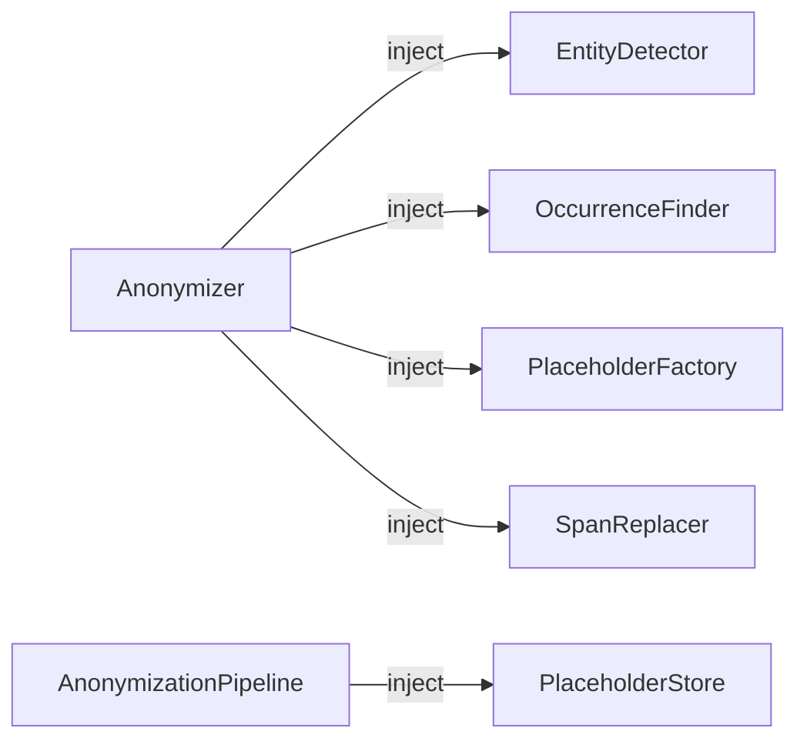

# Étendre PIIGhost

PIIGhost est conçu autour de **protocoles** (typage structurel Python). Chaque étape du pipeline est un point d'injection où vous pouvez brancher votre propre implémentation sans toucher au reste du code.



Aucune classe de base à hériter. Il suffit d'implémenter la méthode requise Python vérifie la compatibilité au moment de l'appel.

---

## Créer un `EntityDetector` personnalisé

**Quand l'utiliser** : remplacer GLiNER2 par spaCy, un appel API distant, une liste blanche, etc.

### Protocole

```python
class EntityDetector(Protocol):
    def detect(self, text: str, labels: Sequence[str]) -> list[Entity]:
        ...
```

### Exemple Détecteur spaCy

```python
from typing import Sequence
import spacy
from piighost.anonymizer.models import Entity

class SpacyDetector:
    """Détecteur NER basé sur spaCy."""

    def __init__(self, model_name: str = "fr_core_news_sm"):
        self._nlp = spacy.load(model_name)

    def detect(self, text: str, labels: Sequence[str]) -> list[Entity]:
        doc = self._nlp(text)
        return [
            Entity(
                text=ent.text,
                label=ent.label_,
                start=ent.start_char,
                end=ent.end_char,
                score=1.0,
            )
            for ent in doc.ents
            if ent.label_ in labels
        ]
```

### Exemple Détecteur par liste blanche

```python
from typing import Sequence
from piighost.anonymizer.models import Entity

class AllowlistDetector:
    """Détecte les entités d'une liste fixe (utile pour les tests ou les données structurées)."""

    def __init__(self, allowlist: dict[str, str]):
        # {"Patrick Dupont": "PERSON", "Paris": "LOCATION"}
        self._allowlist = allowlist

    def detect(self, text: str, labels: Sequence[str]) -> list[Entity]:
        entities = []
        for fragment, label in self._allowlist.items():
            if label not in labels:
                continue
            start = text.find(fragment)
            if start != -1:
                entities.append(Entity(
                    text=fragment,
                    label=label,
                    start=start,
                    end=start + len(fragment),
                    score=1.0,
                ))
        return entities
```

### Utilisation

```python
from piighost.anonymizer import Anonymizer

anonymizer = Anonymizer(detector=SpacyDetector("fr_core_news_sm"))
# ou
anonymizer = Anonymizer(detector=AllowlistDetector({"Patrick": "PERSON"}))
```

---

## Créer un `OccurrenceFinder` personnalisé

**Quand l'utiliser** : correspondance floue (fautes de frappe, variantes phonétiques), recherche exact case-sensitive, etc.

### Protocole

```python
class OccurrenceFinder(Protocol):
    def find_all(self, text: str, fragment: str) -> list[tuple[int, int]]:
        ...
```

### Exemple Recherche exacte (case-sensitive)

```python
class ExactOccurrenceFinder:
    """Trouve toutes les occurrences exactes (sensible à la casse)."""

    def find_all(self, text: str, fragment: str) -> list[tuple[int, int]]:
        results = []
        start = 0
        while True:
            idx = text.find(fragment, start)
            if idx == -1:
                break
            results.append((idx, idx + len(fragment)))
            start = idx + 1
        return results
```

### Exemple Correspondance floue (Levenshtein)

```python
from rapidfuzz import fuzz, process

class FuzzyOccurrenceFinder:
    """Détecte les entités même avec des fautes de frappe (score > 80)."""

    def __init__(self, threshold: int = 80):
        self._threshold = threshold

    def find_all(self, text: str, fragment: str) -> list[tuple[int, int]]:
        # Découpe le texte en mots et cherche les correspondances proches
        results = []
        words = text.split()
        offset = 0
        for word in words:
            score = fuzz.ratio(word, fragment)
            if score >= self._threshold:
                start = text.find(word, offset)
                results.append((start, start + len(word)))
            offset += len(word) + 1
        return results
```

### Utilisation

```python
anonymizer = Anonymizer(
    detector=my_detector,
    occurrence_finder=ExactOccurrenceFinder(),
)
```

---

## Créer un `PlaceholderFactory` personnalisé

**Quand l'utiliser** : tags UUID pour l'anonymat total, format personnalisé, intégration avec un système de tokens externe.

### Protocole

```python
class PlaceholderFactory(Protocol):
    def get_or_create(self, original: str, label: str) -> Placeholder:
        ...

    def reset(self) -> None:
        ...
```

### Exemple Tags UUID

```python
import uuid
from piighost.anonymizer.models import Placeholder

class UUIDPlaceholderFactory:
    """Génère des tags UUID opaques, ex: <<a3f2-1b4c>>."""

    def __init__(self):
        self._cache: dict[tuple[str, str], Placeholder] = {}

    def get_or_create(self, original: str, label: str) -> Placeholder:
        key = (original, label)
        if key not in self._cache:
            token = str(uuid.uuid4())[:8]
            self._cache[key] = Placeholder(
                original=original,
                label=label,
                replacement=f"<<{token}>>",
            )
        return self._cache[key]

    def reset(self) -> None:
        self._cache.clear()
```

### Exemple Format personnalisé

```python
from piighost.anonymizer.models import Placeholder

class BracketPlaceholderFactory:
    """Génère des tags au format [PERSON:1], [LOCATION:2], etc."""

    def __init__(self):
        self._counters: dict[str, int] = {}
        self._cache: dict[tuple[str, str], Placeholder] = {}

    def get_or_create(self, original: str, label: str) -> Placeholder:
        key = (original, label)
        if key not in self._cache:
            self._counters[label] = self._counters.get(label, 0) + 1
            replacement = f"[{label}:{self._counters[label]}]"
            self._cache[key] = Placeholder(original=original, label=label, replacement=replacement)
        return self._cache[key]

    def reset(self) -> None:
        self._counters.clear()
        self._cache.clear()
```

### Utilisation

```python
anonymizer = Anonymizer(
    detector=my_detector,
    placeholder_factory=UUIDPlaceholderFactory(),
)
```

---

## Créer un `PlaceholderStore` personnalisé

**Quand l'utiliser** : persistance inter-sessions via Redis, PostgreSQL ou tout autre backend.

### Protocole

```python
class PlaceholderStore(Protocol):
    async def get(self, key: str) -> AnonymizationResult | None:
        ...

    async def set(self, key: str, result: AnonymizationResult) -> None:
        ...
```

La clé est un hash **SHA-256** du texte source.

### Exemple Backend Redis

```python
import pickle
from piighost.anonymizer.models import AnonymizationResult

class RedisPlaceholderStore:
    """Store Redis pour la persistance inter-processus et inter-sessions."""

    def __init__(self, client, prefix: str = "piighost", ttl: int = 86400):
        self._client = client  # client Redis async (ex: redis.asyncio)
        self._prefix = prefix
        self._ttl = ttl

    async def get(self, key: str) -> AnonymizationResult | None:
        data = await self._client.get(f"{self._prefix}:{key}")
        return pickle.loads(data) if data else None

    async def set(self, key: str, result: AnonymizationResult) -> None:
        data = pickle.dumps(result)
        await self._client.setex(f"{self._prefix}:{key}", self._ttl, data)
```

### Exemple Backend PostgreSQL (asyncpg)

```python
import json
import pickle
from piighost.anonymizer.models import AnonymizationResult

class PostgresPlaceholderStore:
    """Store PostgreSQL pour les déploiements multi-instances."""

    def __init__(self, pool):
        self._pool = pool  # asyncpg pool

    async def get(self, key: str) -> AnonymizationResult | None:
        async with self._pool.acquire() as conn:
            row = await conn.fetchrow(
                "SELECT data FROM piighost_cache WHERE key = $1", key
            )
            return pickle.loads(row["data"]) if row else None

    async def set(self, key: str, result: AnonymizationResult) -> None:
        async with self._pool.acquire() as conn:
            await conn.execute(
                """
                INSERT INTO piighost_cache (key, data) VALUES ($1, $2)
                ON CONFLICT (key) DO UPDATE SET data = EXCLUDED.data
                """,
                key,
                pickle.dumps(result),
            )
```

### Utilisation

```python
from piighost.pipeline import AnonymizationPipeline

pipeline = AnonymizationPipeline(
    anonymizer=anonymizer,
    labels=["PERSON", "LOCATION"],
    store=RedisPlaceholderStore(redis_client),
)
```

---

## Composition complète

Tous les composants sont indépendants et peuvent être combinés librement :

```python
from piighost.anonymizer import Anonymizer
from piighost.pipeline import AnonymizationPipeline
from piighost.middleware import PIIAnonymizationMiddleware

anonymizer = Anonymizer(
    detector=SpacyDetector("fr_core_news_sm"),       # Votre détecteur
    occurrence_finder=FuzzyOccurrenceFinder(80),      # Correspondance floue
    placeholder_factory=UUIDPlaceholderFactory(),     # Tags UUID opaques
)

pipeline = AnonymizationPipeline(
    anonymizer=anonymizer,
    labels=["PERSON", "LOCATION", "ORGANIZATION"],
    store=RedisPlaceholderStore(redis_client),         # Persistance Redis
)

middleware = PIIAnonymizationMiddleware(pipeline=pipeline)
```

---

## Écrire des tests pour ses composants

Les protocoles facilitent les tests unitaires. Voici comment tester un détecteur personnalisé :

```python
import pytest
from piighost.anonymizer import Anonymizer
from piighost.anonymizer.models import Entity

class FakeDetector:
    def __init__(self, entities):
        self.entities = entities

    def detect(self, text, labels):
        return self.entities

def test_my_anonymizer():
    entities = [Entity(text="Alice", label="PERSON", start=0, end=5, score=1.0)]
    anonymizer = Anonymizer(detector=FakeDetector(entities))

    result = anonymizer.anonymize("Alice habite à Lyon.", labels=["PERSON", "LOCATION"])
    assert "<<PERSON_1>>" in result.anonymized_text
    assert "Alice" not in result.anonymized_text
```

!!! tip "FakeDetector dans les tests CI"
    Utilisez toujours `FakeDetector` (ou équivalent) en CI pour éviter de charger le modèle GLiNER2 (~500 Mo) lors des tests automatisés.
