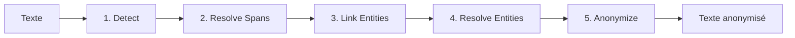

# PIIGhost

`piighost` est une bibliothèque Python qui détecte, anonymise et désanonymise automatiquement les entités sensibles (noms, lieux, numéros de compte…) dans les conversations d'agents IA. Son middleware LangChain s'intègre dans LangGraph sans modifier votre code existant : le LLM ne voit que des placeholders, les outils reçoivent les vraies valeurs, l'utilisateur voit la réponse désanonymisée.

## Cas d'usage

Cinq familles de scénarios où `piighost` trouve naturellement sa place, du plus défensif (protéger l'utilisateur) au plus intégré (agents outillés).

**1. Protéger l'utilisateur face aux providers LLM tiers.** Les APIs cloud peuvent stocker, croiser et exploiter les PII : profilage commercial, réquisition légale, entraînement sur les conversations, ciblage de journalistes, de lanceurs d'alerte ou de politiques.

*Exemple : assistant médical grand public dont les conversations ne doivent pas quitter votre infrastructure avec le nom du patient.*

**2. Extraction structurée sans fuite dans le JSON.** Quand un LLM extrait des champs vers un schéma, les PII réapparaissent telles quelles en sortie. Avec `piighost`, le modèle manipule uniquement des placeholders ; la désanonymisation restaure les vraies valeurs côté client.

*Exemple : extraction d'un acte notarial vers un JSON (parties, biens, montants) sans que le LLM ait accès aux identités réelles.*

**3. Caviardage de documents.** Produire une version publiable d'un document confidentiel en protégeant les personnes physiques, tout en gardant un texte lisible et exploitable.

*Exemple : anonymiser un jugement avant diffusion open-access.*

**4. RAG d'entreprise sur documents privés.** Un RAG classique sur un LLM cloud vous cantonne de fait aux documents déjà publics : dès qu'on y verse un contrat interne, un dossier RH ou une note stratégique, le provider l'ingère. En anonymisant les chunks récupérés avant l'envoi au modèle, vous pouvez indexer des documents réellement privés tout en gardant un LLM hébergé.

*Exemple : base documentaire juridique interne (contrats, jurisprudence annotée) interrogée via un LLM cloud sans que noms de clients, montants ou clauses sensibles ne quittent votre infrastructure.*

**5. Agents avec outils internes.** Le LLM raisonne sur des placeholders, les outils (CRM, email, DB) reçoivent les vraies valeurs au moment de l'appel. Le modèle ne voit jamais les PII, les outils fonctionnent normalement.

*Exemple : agent commercial qui consulte le CRM et envoie un email sans que le LLM ait lu les noms des clients.*

**6. Réduction des biais.** Les LLM héritent des biais présents dans leurs données d'entraînement (genre, origine, âge). Anonymiser un prénom, un nom ou un lieu avant d'envoyer un texte au modèle évite que ces biais n'influencent une décision : le LLM ne juge plus que le contenu.

*Exemple : tri de CV où prénoms, noms et adresses sont remplacés par des placeholders pour neutraliser les biais discriminatoires sur le profil du candidat.*

---

## Problématiques

Aujourd'hui, avec l'essor des LLM, la question de la protection des données sensibles prend une nouvelle dimension. Les
entreprises qui hébergent ces modèles peuvent potentiellement exploiter les données que leurs utilisateurs leur
envoient, et se reposer uniquement sur le RGPD offre une garantie juridique mais pas technique. Parallèlement, les
modèles propriétaires (GPT, Claude, Gemini) restent souvent plus puissants que leurs équivalents open-source : on
ne veut pas avoir à choisir entre performance et confidentialité. Anonymiser les PII avant qu'ils atteignent le LLM
permet de profiter des modèles les plus capables tout en gardant la main sur les données de ses utilisateurs.

!!! info "Qu'est-ce qu'un PII ?"
    Un *PII* (**P**ersonal **I**dentifiable **I**nformation) est une donnée qui permet d'identifier une personne :
    nom, adresse, téléphone, email, lieu, organisation… Les anonymiser dans les conversations d'agents IA est devenu
    un enjeu de confidentialité à part entière : un LLM hébergé chez un tiers ne devrait pas voir les données
    sensibles de vos utilisateurs.

!!! tip "Première fois sur ces termes ?"
    Consultez le [Glossaire](glossary.md) pour les définitions de NER, span, liaison d'entités, middleware, placeholder et plus.

Sur le papier, anonymiser des PII est simple : on prend un détecteur (regex pour les emails, modèle NER pour les noms), on remplace ce qui matche par des placeholders, et on envoie au LLM. En pratique, quatre problèmes apparaissent presque immédiatement.

**Cohérence des placeholders.** Le but est de remplacer `Patrick`{ .pii } par un placeholder du type `<<PERSON:1>>`{ .placeholder }, qui dit deux choses au LLM : on a caché une personne ici, et toutes les occurrences de `<<PERSON:1>>`{ .placeholder } parlent de la même personne. Si `Patrick`{ .pii } devient `<<PERSON:1>>`{ .placeholder } au début et `<<PERSON:3>>`{ .placeholder } à la fin, le LLM ne peut plus raisonner sur le fait qu'il s'agit du même individu.

**Variantes ratées par le détecteur.** Le NER détecte `Patrick Dupont`{ .pii } en début de texte mais rate `Patrick`{ .pii } tout seul deux phrases plus loin. Ou il détecte `Patrick`{ .pii } mais pas `patrick`{ .pii } en bas de casse. Ou pas `Patriick`{ .pii } avec une faute d'orthographe.

**Chevauchement entre détecteurs.** Deux NER chaînés pour augmenter le rappel peuvent revendiquer le même span avec des labels différents (l'un dit `PERSON`, l'autre dit `ORG` parce qu'il a confondu avec un nom d'entreprise). Sans arbitrage, le remplacement final tape sur la même position deux fois et casse le texte.

**Persistance entre messages.** Une fois que le LLM a vu `<<PERSON:1>>`{ .placeholder } dans le message 1, il faut que le message 2 utilise le même placeholder. Sans mémoire partagée, `Patrick`{ .pii } devient `<<PERSON:1>>`{ .placeholder } puis `<<PERSON:7>>`{ .placeholder } selon le moment, et le LLM perd le fil.

`piighost` adresse les trois premiers via trois composants du pipeline (résolution de spans, liaison
d'entités, fusion d'entités), et le quatrième via la couche conversationnelle (`ThreadAnonymizationPipeline`).
Chaque composant a une **contrepartie** : la résolution de spans peut écarter
une détection légitime sur un faux conflit, la liaison floue peut grouper à tort deux entités distinctes, etc.
Si vos détections sont déjà propres (ou si vous préférez gérer ces cas vous-même), chaque composant est
**désactivable individuellement** via une instance `Disabled*` qui le transforme en passe-plat. Voir
[Étendre PIIGhost](extending.md) pour le détail de chaque section.

### Le cas conversationnel (agents IA)

Pour utiliser l'anonymisation dans des agents IA, plusieurs contraintes supplémentaires apparaissent :

- **Transparence** : l'utilisateur envoie son message en clair et reçoit la réponse en clair, sans avoir à se
  soucier de l'anonymisation.
- **Utilisation par des outils externes** : l'agent doit pouvoir appeler un outil (ex. récupérer la météo d'une
  ville mentionnée) avec les vraies valeurs, sans que le LLM lui-même les voie.
- **Persistance inter-messages** : une entité anonymisée dans le premier message doit l'être de la même manière
  dans tous les messages suivants, côté utilisateur comme côté agent, pour que l'agent puisse raisonner sur
  l'identité des PII au fil de la conversation.

---

## Solution

`piighost` combine les briques existantes pour offrir une détection et une anonymisation des PII à la fois précises,
cohérentes et faciles à intégrer :

- **Détection hybride** : composez un ou plusieurs backends NER et des regex via `CompositeDetector` pour
  tirer parti des deux mondes.
- **Liaison d'entités** : regroupe automatiquement les variantes (casse, fautes, mentions partielles) pour
  garantir des placeholders cohérents.
- **Anonymisation bidirectionnelle** : chaque anonymisation est cachée et peut être inversée à la volée, y compris
  sur du texte produit par un LLM qui n'a jamais vu les vraies valeurs.
- **Middleware LangChain** : intégration transparente dans un agent LangGraph, sans modifier votre code d'agent.
  Le LLM ne voit que des placeholders, les outils reçoivent les vraies valeurs, l'utilisateur voit la réponse
  désanonymisée.

---

## Comment ça marche

Le cœur de la librairie est un pipeline en 5 étapes, chacune branchable via une interface :

1. **Detect** : plusieurs détecteurs (NER, regex) repèrent les candidats PII.
2. **Resolve Spans** : arbitrage des chevauchements et imbrications entre détections.
3. **Link Entities** : regroupement des occurrences d'une même entité (y compris fautes et variations de casse).
4. **Resolve Entities** : fusion des groupes incohérents entre détecteurs.
5. **Anonymize** : remplacement par des placeholders via une factory pluggable.

Voir [Architecture](architecture.md) pour les détails de chaque étape.

---

## Pourquoi pas une solution existante ?

D'autres librairies couvrent une partie du périmètre :

- **[Microsoft Presidio](https://github.com/microsoft/presidio)** : catalogue riche de recognizers prêts à
  l'emploi (cartes bancaires validées par Luhn, IBAN avec checksum, SSN, passeports, emails, téléphones) enrichis
  par scoring contextuel par mots-clés, avec un moteur NER branché sur spaCy / stanza / transformers. Pas de
  liaison inter-messages native ni de middleware LangChain bidirectionnel. Excellent comme moteur de détection
  brut, mais laisse au développeur la charge d'orchestrer le cas conversationnel.
- **Extensions spaCy / regex custom** : bon pour des pipelines de traitement batch, mais ne gèrent pas l'aller-retour
  anonymisation/désanonymisation au fil d'une conversation.

Le différenciateur de `piighost` : **la liaison persistante inter-messages** et un **middleware bidirectionnel**
(texte → placeholders → LLM → texte → outils → placeholders → utilisateur) qui fonctionne tel quel dans LangGraph.

---

## Aperçu

Entrée :

> `Patrick`{ .pii } habite à `Paris`{ .pii }. `Patrick`{ .pii } adore `Paris`{ .pii }.

Sortie :

> `<<PERSON:1>>`{ .placeholder } habite à `<<LOCATION:1>>`{ .placeholder }. `<<PERSON:1>>`{ .placeholder } adore `<<LOCATION:1>>`{ .placeholder }.

Les deux occurrences de `Patrick`{ .pii } sont reliées, idem pour `Paris`{ .pii }. Dans une conversation, les
messages suivants réutilisent les mêmes placeholders, et la désanonymisation est automatique pour l'utilisateur final.

Pour l'installation et le premier exemple complet, voir [Installation](getting-started/installation.md) puis [Premier pipeline](getting-started/first-pipeline.md).

---

## Navigation

Chaque page suit un rôle précis du [framework Diátaxis](https://diataxis.fr/) : tutoriel pour apprendre, how-to pour résoudre une tâche, référence pour consulter l'API, explication pour comprendre les choix de design.

-   :lucide-rocket: __Démarrer__

    ---

    Installer et prendre piighost en main.

    - [Installation](getting-started/installation.md)
    - [Quickstart](getting-started/quickstart.md)
    - [Premier pipeline](getting-started/first-pipeline.md)
    - [Pipeline conversationnel](getting-started/conversation.md)
    - [Middleware LangChain](getting-started/langchain.md)
    - [Client distant](getting-started/api-client.md)
    - [Usage basique](examples/basic.md)

-   :lucide-wrench: __Usage__

    ---

    Recettes ciblées pour un cas d'usage.

    - [Intégration LangChain](examples/langchain.md)
    - [Détecteurs prêts à l'emploi](examples/detectors.md)
    - [Étendre PIIGhost](extending.md)
    - [Tests](examples/testing.md)
    - [Déploiement](deployment.md)

-   :lucide-book-open: __Référence__

    ---

    La documentation d'API complète.

    - [Anonymizer](reference/anonymizer.md)
    - [Pipeline](reference/pipeline.md)
    - [Middleware](reference/middleware.md)
    - [Détecteurs](reference/detectors.md)

-   :lucide-layers: __Concepts__

    ---

    Comprendre les choix de design.

    - [Architecture](architecture.md)
    - [Glossaire](glossary.md)
    - [Limites](limitations.md)
    - [Sécurité](security.md)

-   :lucide-users: __Communauté__

    ---

    Participer, signaler, échanger.

    - [Contribuer](community/contributing.md)
    - [Code de conduite](community/code-of-conduct.md)
    - [Signaler un bug](community/bug-reports.md)
    - [FAQ](community/faq.md)

