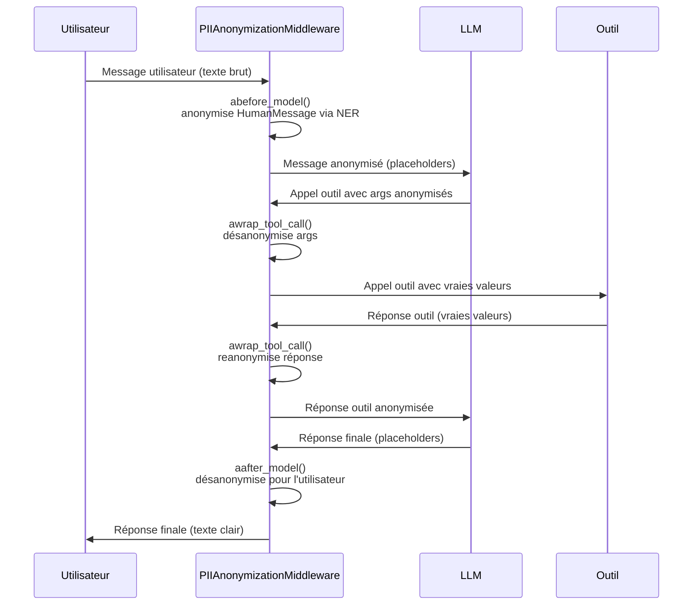

# Référence Middleware

Module : `piighost.middleware`

---

## `PIIAnonymizationMiddleware`

Middleware LangChain qui anonymise les données personnelles de façon transparente autour de la frontière LLM / outils.

Étend `AgentMiddleware` de LangChain et intercepte le cycle de l'agent en **3 points** :

| Hook | Moment | Opération |
|------|--------|-----------|
| `abefore_model` | Avant chaque appel LLM | Anonymise tous les messages |
| `aafter_model` | Après chaque réponse LLM | Désanonymise pour l'utilisateur |
| `awrap_tool_call` | Autour de chaque outil | Désanonymise les args, ré-anonymise la réponse |

### Constructeur

```python
PIIAnonymizationMiddleware(pipeline: AnonymizationPipeline)
```

| Paramètre | Type | Description |
|-----------|------|-------------|
| `pipeline` | `AnonymizationPipeline` | Pipeline configuré avec anonymizer, labels et store |

### Utilisation

```python
from piighost.middleware import PIIAnonymizationMiddleware
from piighost.pipeline import AnonymizationPipeline
from langchain.agents import create_agent

middleware = PIIAnonymizationMiddleware(pipeline=pipeline)

agent = create_agent(
    model="openai:gpt-4o-mini",
    tools=[...],
    middleware=[middleware],
)
```

---

## Hooks détaillés

### `abefore_model(state, runtime) → dict | None` *(async)*

Appelé avant chaque appel au LLM. Anonymise tous les messages de la conversation.

**Comportement par type de message :**

- `HumanMessage` → **NER complet** via `pipeline.anonymize()` (détecte de nouvelles entités)
- `AIMessage` → **remplacement de chaîne** via `pipeline.reanonymize_text()`
- `ToolMessage` → **remplacement de chaîne** via `pipeline.reanonymize_text()`

```python
# Avant abefore_model :
# [HumanMessage("Envoie un email à Patrick à Paris")]

# Après abefore_model :
# [HumanMessage("Envoie un email à <<PERSON_1>> à <<LOCATION_1>>")]
```

**Retourne** : `{"messages": [...]}` si des modifications ont eu lieu, `None` sinon.

---

### `aafter_model(state, runtime) → dict | None` *(async)*

Appelé après chaque réponse du LLM. Désanonymise tous les messages pour que l'utilisateur voie les vraies valeurs.

```python
# Avant aafter_model :
# [AIMessage("C'est fait ! Email envoyé à <<PERSON_1>>.")]

# Après aafter_model :
# [AIMessage("C'est fait ! Email envoyé à Patrick.")]
```

Les métadonnées des messages (`id`, `name`, `tool_calls`) sont préservées lors de la reconstruction.

**Retourne** : `{"messages": [...]}` si des modifications ont eu lieu, `None` sinon.

---

### `awrap_tool_call(request, handler) → ToolMessage | Command` *(async)*

Enveloppe chaque appel d'outil en 3 étapes :

1. **Désanonymise** les arguments `str` → l'outil reçoit les vraies valeurs
2. **Exécute** l'outil via `handler(request)`
3. **Reanonymise** la réponse de l'outil → le LLM ne voit pas de données personnelles

```python
# LLM appelle : send_email(to="<<PERSON_1>>", subject="Bonjour")
#                        ↓  désanonymise args
# Outil reçoit : send_email(to="Patrick", subject="Bonjour")
# Outil retourne: "Email envoyé à Patrick."
#                        ↓  reanonymise réponse
# LLM voit     : "Email envoyé à <<PERSON_1>>."
```

Seuls les arguments de type `str` sont désanonymisés. Les types non-string sont passés tels quels.

---

## Flux complet



---

## Dépendance LangChain

`PIIAnonymizationMiddleware` requiert que `langchain` soit installé. Si ce n'est pas le cas, une `ImportError` est levée lors de l'import :

```
ImportError: You must install piighost[langchain] for use middleware
```

Installation :

```bash
uv add piighost langchain langgraph
```

---

## Exemple complet

```python
import asyncio
from gliner2 import GLiNER2
from langchain.agents import create_agent
from langchain_core.tools import tool

from piighost.anonymizer import Anonymizer, GlinerDetector
from piighost.middleware import PIIAnonymizationMiddleware
from piighost.pipeline import AnonymizationPipeline

@tool
def get_info(person: str) -> str:
    """Retourne des informations sur une personne."""
    return f"{person} est ingénieur logiciel à Paris."

model = GLiNER2.from_pretrained("fastino/gliner2-multi-v1")
detector = GlinerDetector(model=model, threshold=0.5)
anonymizer = Anonymizer(detector=detector)
pipeline = AnonymizationPipeline(anonymizer=anonymizer, labels=["PERSON", "LOCATION"])
middleware = PIIAnonymizationMiddleware(pipeline=pipeline)

agent = create_agent(
    model="openai:gpt-4o-mini",
    system_prompt="Tu es un assistant utile. Traite les placeholders comme des vraies valeurs.",
    tools=[get_info],
    middleware=[middleware],
)

async def main():
    result = await agent.ainvoke({
        "messages": [{"role": "user", "content": "Qui est Patrick ?"}]
    })
    print(result["messages"][-1].content)

asyncio.run(main())
```
